# X) Summaries/ Tiivistelmät

## 1. Herrasmieshakkerit - Haavoittuvuuksien metsästäjä, vieraana Harry Sintonen | 0x23 

Harry Sintonen on tunnettu hakkeri, joka on löytänyt poikkeuksellisen monta korkean profiilin tietoturvahaavoittuvuutta. Hänellä on laaja kokemus sekä ohjelmisto- ja laitehaavoittuvuuksista että reaalimaailman tietoturvamurroista.
  
<ins>Kohteen valinta:</ins>  
- Kohteena voi usein olla fyysinen laite, johon on päästy käsiksi esim. harrastemielessä, tai hiljattain uutisoitu sovellusjulkaisu.

<ins>Miten haavoittuvuuksia etsitään kohteen valinnan jälkeen:</ins>  
1. Ennen haavoittuvuuksien etsimistä, perehdy kohdelaitteen tai -sovelluksen yleiskuvaan: sen normaaliin käyttötarkoitukseen ja sisältyviin toiminnallisuuksiin. Kiinnitä huomiota poikkeavuuksiin tai ominaisuuksiin, jotka voivat toimia lähtökohtana haavoittuvuuksien etsinnälle tai joissa on aiemmin havaittu turvallisuuspuutteita.
   
2. Eri vaihtoehtoja etsiä haavoittuvuuksia:
    - Laiteohjelmiston (firmware) päivitykset: Lataa valmistajan tarjoama laiteohjelmiston päivitys, jos se on saatavilla. Tutki, miten ohjelmisto toimii laitteessa ja analysoi sitä tarkemmin. Tämä voi vaatia takaisinmallinnusta (reverse engineering) haavoittuvuuksien löytämiseksi.
    - Verkkoliikenne: Tarkista, onko liikenne salattua vai salaamatonta. Jos liikenne on salattua (esim. TLS), voit yrittää asettua liikenteen väliin ja analysoida, miten laite validoi yhteyksiä ja minkä kohteen kanssa laite kommunikoi.
    - Psykologinen näkökulma (tiimidynamiikka): Haavoittuvuuksia voi, joissain tapauksissa löytyä "tylsistä" ominaisuuksista, jos niiden toteutus on delegoitu kokemattomille kehittäjille kokeneempien sijaan.

<ins>Kuinka haavoittuvuuksien etsiminen on muuttunut:</ins>  
- Haavoittuvuuksien löytäminen on vaikeampaa kuin ennen. Helposti hyödynnettäviä haavoittuvuuksia on yhä harvemmassa, ja laitteiden tekninen tietoturva on kehittynyt merkittävästi.
- Modernit kehitysmenetelmät, frameworkit ja työkalut noudattavat oletuksena hyviä tietoturvakäytäntöjä, mikä tekee haavoittuvuuksien löytämisestä ja hyödyntämisestä huomattavasti vaikeampaa.
- Haavoittuvuuspalkkio-ohjelmat (bug bountyt) ovat parantaneet tietoturvan tasoa, koska suuri määrä asiantuntijoita analysoi järjestelmiä aktiivisesti.
- Fuzzing eli automatisoitu testaus osana sovelluskehitystä on parantanut sovellusten tietoturvaa ja harventanut yksinkertaisten haavoittuvuuksien löytymistä.
- Toisaalta, koska sovellukset ovat nykyään monimutkaisempia, myös hyökkäyspinta on laajentunut merkittävästi verrattuna aiempaan.

<ins>Tarinoita haavoittuvuuksien etsimisestä & löytämisestä:</ins>  
- Merkittäville haavoittuvuuksille annetaan CVE (Common Vulnerabilities and Exposures) -pisteytys, joka arvioi haavoittuvuuden vakavuuden asteikolla 0–10. Mitä korkeampi pisteytys, sitä vakavampi haavoittuvuus.
- Sintonen on löytänyt ja raportoinut useita kymmeniä CVE:itä/haavoittuvuuksia (arvio 40–50 kpl).
- Podcastissa käydään läpi muutamia esimerkkitapauksia.

## 2. Intelligence-Driven Computer Network Defense Informed by Analysis of Adversary Campaigns and Intrusion Kill Chains

- Traditional security tools and response methods focus on vulnerabilities and assume that defensive efforts should occur in response to a successful attack, treating the compromise as a result of a fixable flaw. This "reactive" approach is often ineffective against more advanced threats, such as APTs, skilled attackers, and sophisticated tools.
- APTs (Advanced Persistent Threats) are a newer, more advanced type of threat involving well-funded and skilled attackers who carry out long-term campaigns targeting sensitive information, like economic, proprietary, or national security data.
- Intelligence-driven computer network defense (CND) is a strategy that improves security and reduces the likelihood of success for attackers. It uses knowledge gained from studying adversaries’ behaviors during each intrusion attempt, identifying patterns, and predicting future threats. This approach is more "proactive" because it addresses both vulnerabilities and the threat components.
- CND uses the Kill Chain model, which outlines different stages of an attack and links each stage to specific defensive actions: detection, mitigation, and response. It helps track attacks at various points, develop strong countermeasures, and prioritize security investments.
- In the Kill Chain model, the attacker must successfully move through each stage in order. Stopping the attacker at any stage can disrupt the chain and prevent success.
  
- The stages of the Kill Chain model are:
  -	Reconnaissance
  -	Weaponization
  -	Delivery
  -	Exploitation
  -	Installation
  -	Command & Control (C2)
  -	Actions on Objectives
    
-	A key goal of CND is to implement defenses faster than attackers evolve, making intrusion attempts more costly and less attractive.

## 3. The Art of Hacking - Active Reconnaissance

<ins>Phases of Reconnaissance</ins>  
- Reconnaissance = Tiedustelu
- The success of subsequent Intrusion Kill Chain phases depend on the completion and success of the Recon phase.
- The Active Recon phase follows immediately after Passive Recon. 

1. Passive Reconnaissance:  
    - Involves gathering information about target from publicly available sources (e.g. web searches, social media profiles etc.), without directly interacting with the target system.
    - Advantages include invisibility to the target system and legality. Cons include potentially inaccurate information.
  
2. Active Reconnaissance:
    - Involves direct, active interaction with the target system to gather more specific information. Includes e.g. port scanning or scanning for security vulnerabilities
    - Advantages include the accuracy of collected information. Cons include the higher risk of getting detected since direct contact is involved (e.g. visibility in logs, setting of alarms) and illegality.

<ins>Active Recon Methodology & tools</ins>
- A solid methodology is important for shifting through large amounts of data to select the right systems and services to attack. 
- Steps in the Active recon methodology:
1. Port scanning
    - Tools: Nmap, Masscan, Udpprotoscanner  
2. Web service review  
    - Tools: EyeWitness  
3. Vulnerability scanning  
    - Network vulnerability scanners: OpenVAS, Nmap (limited), Nessus, Nexpose, Qualys
    - Web vulnerability scanners: Nikto, WPScan, SQLMap, Burp Suite, Zed Attack Proxy

## 4. KKO:2003:36
- Suomen rikoslain mukaan oikeudeton tunkeutuminen tietojärjestelmään on rangaistavaa sakolla tai vankeudella (38 luku: Tieto- ja viestintärikoksista, 8 §). Myös pelkkä yritys on rangaistava.
- Tapaus 2003:36 koskee alaikäistä henkilöä, joka jäi kiinni porttiskannauksesta. Tuomio oli sakkorangaistus, joka velvoitti henkilön maksamaan yhteensä 75 000 markkaa vahingonkorvauksina korkoineen.

### References/ Lähteet:
- Herrasmieshakkerit. (2022). Haavoittuvuuksien metsästäjä, vieraana Harry Sintonen | 0x23. Available at: https://podcasts.apple.com/fi/podcast/haavoittuvuuksien-mets%C3%A4st%C3%A4j%C3%A4-vieraana-harry-sintonen/id1479000931?i=1000588315329
- Hutchins et al 2011: Intelligence-Driven Computer Network Defense Informed by Analysis of Adversary Campaigns and Intrusion Kill Chains, chapters Abstract, 3.2 Intrusion Kill Chain.
- Santos et al: The Art of Hacking (Video Collection): 4.3 Surveying Essential Tools for Active Reconnaissance. Available at: https://learning.oreilly.com/videos/the-art-of/9780135767849/9780135767849-SPTT_04_00/ 
- Finlex. (2003). KKO:2003:36 | Ennakkopäätökset | Korkein oikeus | Finlex. Available at: https://finlex.fi/fi/oikeuskaytanto/korkein-oikeus/ennakkopaatokset/2003/36 

# A) Asenna Kali virtuaalikoneeseen

Virtuaalikoneen ja Kali Linuxin asennus sujui ongelmitta. Referenssinä käytin Kalin virallisia dokumentaatioita ja aiemman kurssin Debian-asennusohjeita.

Ympäristö:
- VirtualBox 7.1.6 platform package / extension pack
- Virtuaalikone (VM):
  - RAM 4GB (4000 MB), Disk space 60GB, CPU x3
  - ISO image: kali-linux-2025.1a-installer-amd64.iso
  - Subtype: Debian, Version: Debian 64-bit
  - Virtuaalikoneen lisäasetukset:
    - Shared clipboard & Drag’n’drop: Bidirectional (General > Advanced)
    - Boot order: 1. Hard disk, 2. Optical (System)
    - Video memory: 128 MB (Display)
    - Muut asetukset oletuksena
      
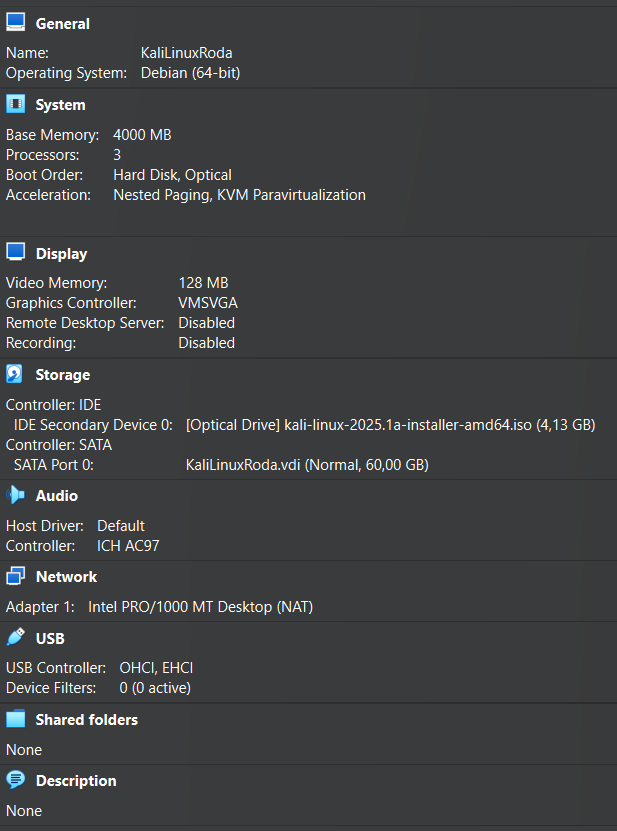

Kali Linux:
- kali-linux-2025.1a-installer-amd64.iso (https://www.kali.org/get-kali/#kali-installer-images)

Järjestelmän päivitys & palomuuriasetukset:

    sudo apt-get update
    sudo apt-get -y dist-upgrade

    sudo apt-get -y install ufw
    sudo ufw enable  (sudo systemctl status ufw)

### References/ Lähteet:
- Kali Linux (2025). Kali inside VirtualBox (Guest VM) | Kali Linux Documentation. Available at: https://www.kali.org/docs/virtualization/install-virtualbox-guest-vm/.
- Kali Linux. (2024). Install Kali Linux | Kali Linux Documentation. [online] Available at: https://www.kali.org/docs/installation/hard-disk-install/.
- Karvinen 2021: Install Debian on Virtualbox - Updated 2024 at https://terokarvinen.com/2021/install-debian-on-virtualbox/

# B) Irroita Kali-virtuaalikone verkosta. Todista testein, että kone ei saa yhteyttä Internetiin.

Alustava tilanne: nettiyhteys testattu selaimella & ping komennolla `ping 8.8.8.8`

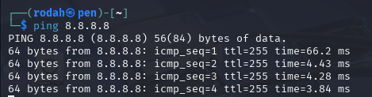

Virtuaalikoneen irroittaminen verkosta: Verkkoasetusten advanced-kohdasta virtuaalinen verkkokaapeli irti

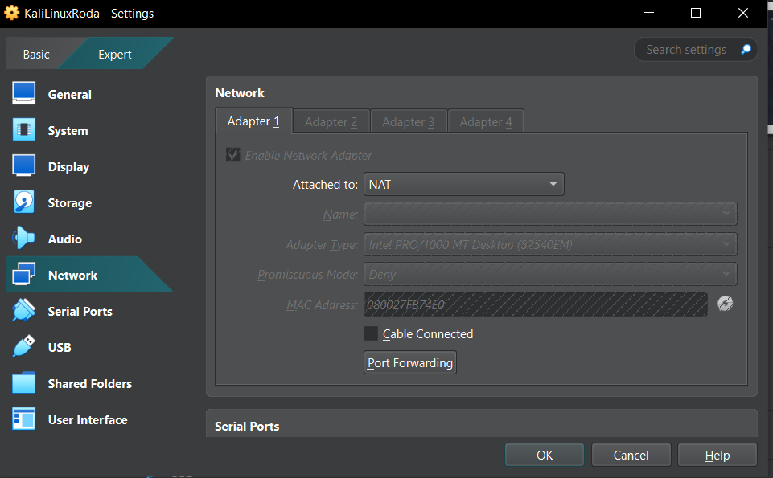

Selain- & pingtestit näyttävät, ettei kone ole yhteydessä internetiin.

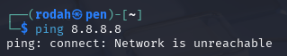
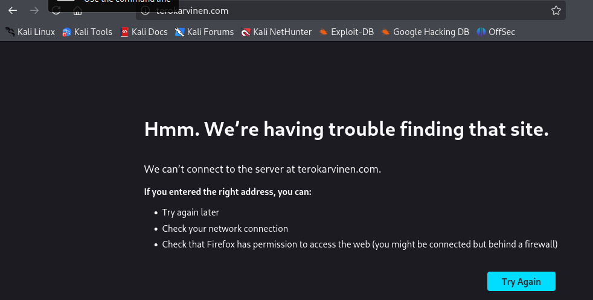

# C) Porttiskannaa 1000 tavallisinta tcp-porttia omasta koneestasi (nmap -T4 -A localhost). Selitä komennon parametrit. Analysoi ja selitä tulokset.

Nmapin asennus & version tarkistus (Marijan, 2024):

    sudo apt-get install nmap -y. 
    nmap --version

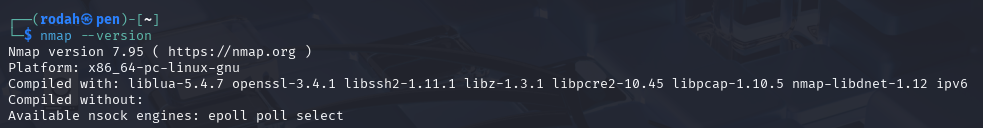 

Porttiskannaus:
- Irroita kone ensin verkosta
- `nmap -T4 -A localhost`
- Komennon parametrit:
    - `nmap` Discovers hosts & services on a computer network
    - `-T4` Option to speed up scans while maintaining relatively good accuracy
    - `-A` Option enables comprehensive scan features (aggressive scanning), including OS detection, version detection, script scanning and traceroute. 
    - `localhost` Refers to the target of the scan, in this case, the local machine (127.0.0.1)
      
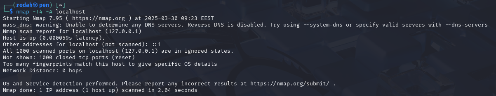 

Skannauksen tulokset:
- Kaikki 1000 skannattua porttia olivat kiinni (ignored states, closed tcp ports), mikä viittaa siihen, ettei järjestelmään ole asennettu palveluja/daemoneja, jotka kuuntelisivat näitä portteja. 
- Network distance: 0 hops osoittaa, ettei Nmap -skannausvälineen ja kohteen (localhost) välillä ole välilaitteita kuten esim. reititintä.  

### References/ Lähteet:
- Zero To Mastery. The Best Nmap Cheat Sheet. Available at: https://zerotomastery.io/cheatsheets/nmap-cheat-sheet/.
- Marijan, B. (2024). How to Install & Use NMAP Security Scanner on Linux. Knowledge Base by phoenixNAP. Available at: https://phoenixnap.com/kb/how-to-install-use-nmap-scanning-linux.

# D) Asenna kaksi vapaavalintaista daemonia. Skannaa uudelleen, analysoi ja selitä erot. 

Daemonien asennus:
- Asennetut daemonit: Apache 2 & OpenSSH
- Kyseisten daemonien asennusprosessi oli tuttu aiemmalta kurssilta (Karvinen 2025 – Information Security). Käytin referenssinä kyseisen kurssin komentoja omasta repostani:

      sudo apt-get update
  
      sudo apt-get -y install apache2   
      sudo systemctl start apache2
      sudo systemctl status apache2
      
      sudo apt-get install ssh 
      sudo systemctl start ssh 
      sudo systemctl status ssh 

Porttiskannauksen tulokset:
- `nmap -T4 -A localhost `
-  Skannaustulokset näyttävät, että SSH kuuntelee porttia 22 ja Apache porttia 80 (http protokolla). SSH:ta käytetään turvallisen etäyhteyden muodostamiseen toiseen järjestelmään. Apache käyttää http protokollaa selaimen ja WWW-palvelimen väliseen keskusteluun.

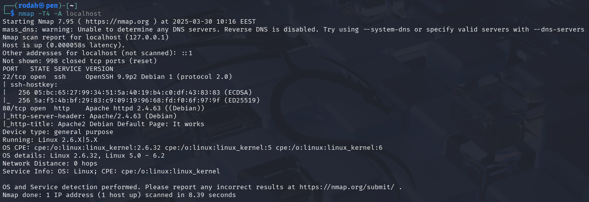 

### References/ Lähteet:
- Karvinen 2025 - Information security at https://terokarvinen.com/information-security/
- https://github.com/hxrda/Information-security-course/tree/main

# E) Asenna Metasploitable 2 virtuaalikoneeseen.

Metasploitable 2 haettu: https://sourceforge.net/projects/metasploitable/  

Lataa ja pura zip-tiedosto (sisältää Metasploitable.vmdk -levytiedoston)  

Uuden virtuaalikoneen luonti Metasploitablelle:
- Type: Linux
- Version: Ubuntu 32-bit
- Memory: 1024 MB
- CPU x1
- Disk: Use an existing hard disk file (Metasploitable.vmdk)
  
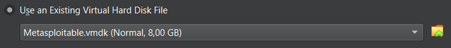  

  

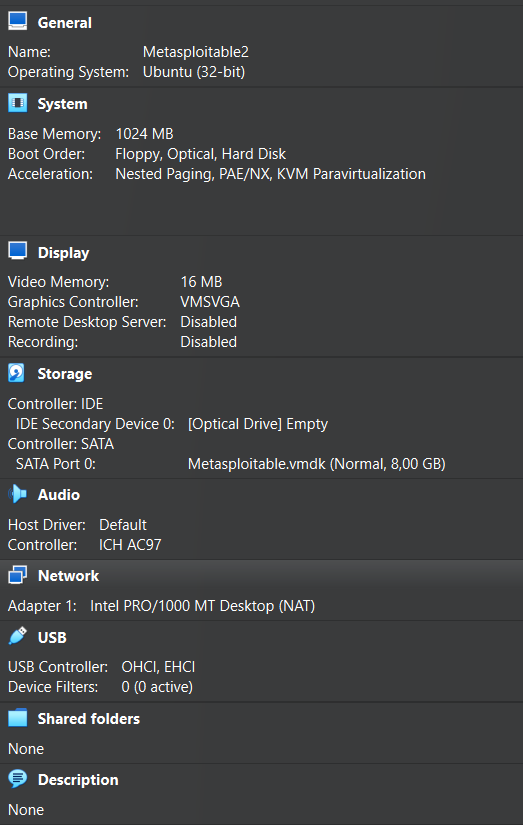  

Koneen käynnistys & testaus:
- Verkkoasetukset: Poista valinta kohdasta Enable network adapter ennen käynnistystä.
- Käynnistä kone & valinnaisesti kirjaudu sisään oletustunnuksilla: `msfadmin:msfadmin`

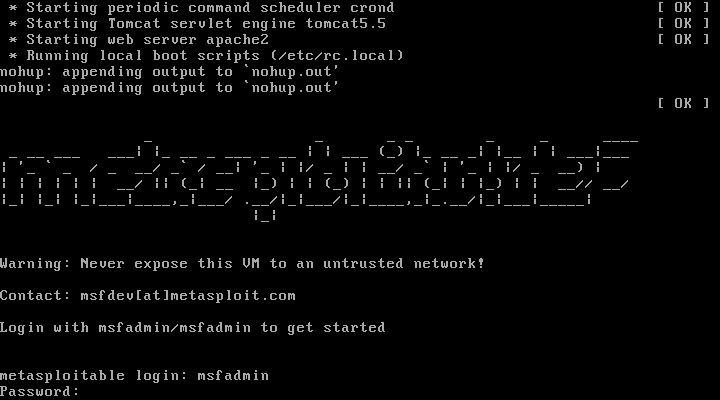  

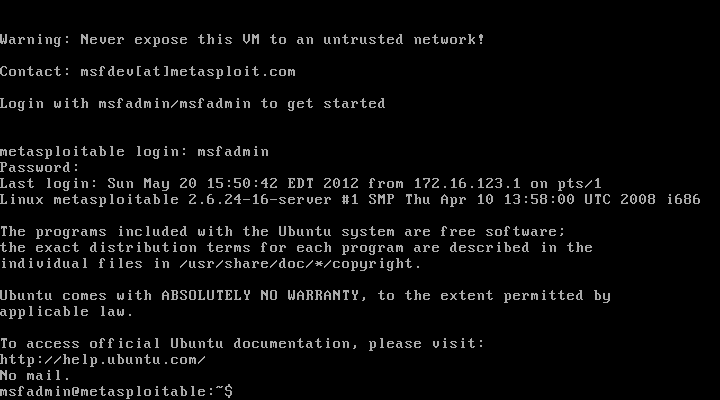 

### References/ Lähteet:
- SourceForge. (2019). Metasploitable. Available at: https://sourceforge.net/projects/metasploitable/.
- James McAlonan (2022). Creating a Metasploitable 2 VM with VirtualBox (Intentionally Vulnerable/Target VM). Available at: https://www.youtube.com/watch?v=vJSA2bM9GoI 

# F) Tee koneiden välille virtuaaliverkko.

## References/ Lähteet:

# G) Etsi Metasploitable porttiskannaamalla

## References/ Lähteet:

# H) Porttiskannaa Metasploitable huolellisesti ja kaikki portit. Poimi 2-3 hyökkääjälle kiinnostavinta porttia

## References/ Lähteet:
