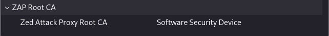
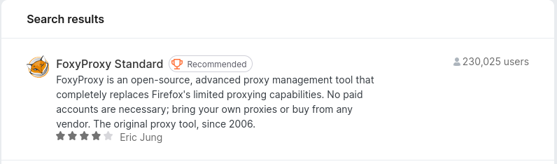
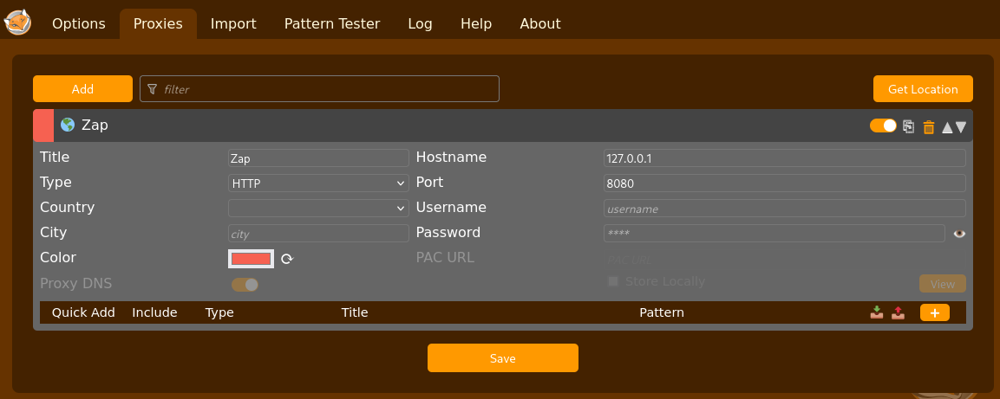
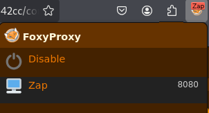
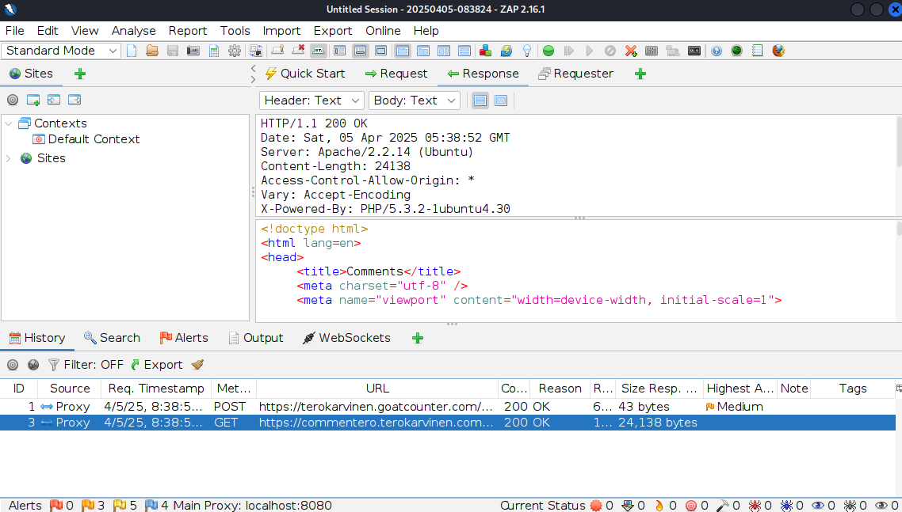
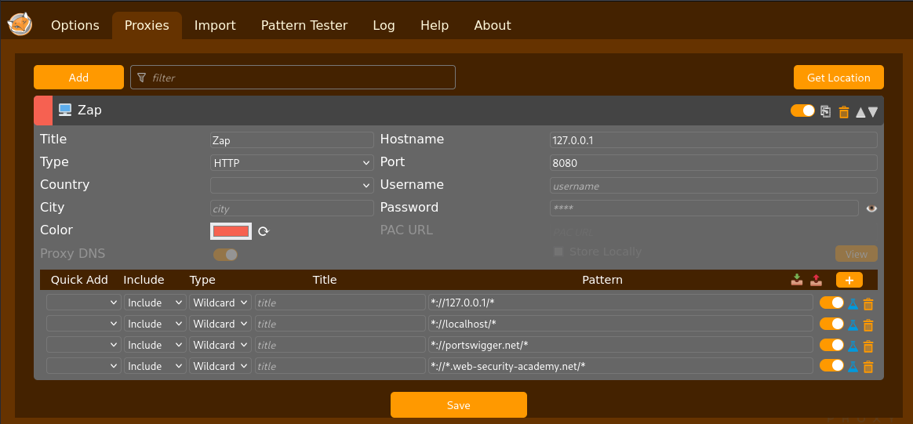
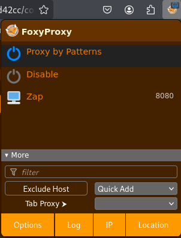
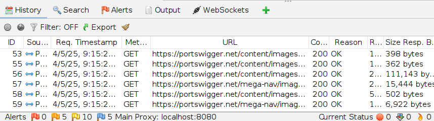
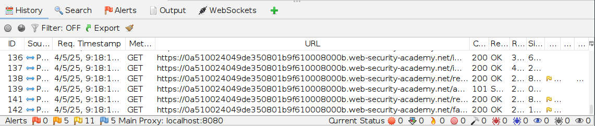
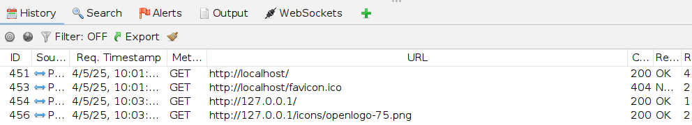

# X) Summaries/ Tiivistelmät

## OWASP Top 10: 2021

[A01:2021 – Broken Access Control](https://owasp.org/Top10/A01_2021-Broken_Access_Control/)

-	Broken access control is ranked 1st in the 2021 list of top 10 web application security risks. It’s a major security risk found in 94% of evaluated web applications.
-	Broken access control occurs when users can access data or perform actions beyond their intended permissions. Proper enforcement of restrictions ensures users can only interact within their designated access levels.
  
-	Common vulnerabilities include:  
    -	Failure to enforce the principle of least privilege or deny-by-default policies, allowing users to gain more access than necessary.
    -	Privilege escalation by tampering with tokens (e.g., JWTs, access control tokens), cookies, or hidden fields to access admin-level functions.
    -	Bypassing restrictions by modifying URLs, API requests, or the application's internal state.
    -	CORS misconfigurations, permitting access from unauthorized or untrusted origins/domains.

-	Prevention:
    -	Enforce access control on the server side (or in serverless APIs) to prevent attackers from bypassing checks or manipulating metadata.
    -	Deny access by default.
    -	Centralize access control mechanisms and apply them consistently throughout the application.
    -	Monitor, log, and restrict access attempts. Alert admins to suspicious patterns, such as repeated failures.
    -	Invalidate session tokens after logout to prevent unauthorized reuse.

[A10:2021 – Server-Side Request Forgery (SSRF)](https://owasp.org/Top10/A10_2021-Server-Side_Request_Forgery_%28SSRF%29/ )

- SSFR ranks 10th  in the 2021 OWASP Top 10 list. While it currently has a low incidence rate (2.72%), its severity/impact is growing higher. The incidence rate of SSRFs is expected to increase in the future.
- SSRF occurs when a web app lets users request external resources but doesn’t properly check/validate the URLs provided by the users. This potentially allows attackers to trick the app into sending requests to unexpected destinations even within protected networks.
- Modern web applications are more susceptible to SSRFs.
  
- Prevention:
    - **Network level defense:** Enforce strict network segmentation and "deny by default" firewall rules to block unnecessary internal traffic and limit the impact of SSRF.
    - **Application level defense:** At the application level, validate and sanitize user inputs, allow only trusted URLs (positive allow list for URL schemas, port, destination), and disable HTTP redirections.
    - **Other security measures:**  Avoid placing security-critical services on exposed/front systems and use encryption for sensitive internal traffic.

## PortSwigger Academy: 

[Insecure direct object references (IDOR)](https://portswigger.net/web-security/access-control/idor)

- A type of access control vulnerability 
- Occurs when a web application directly accesses data, resources, or functions based on user-supplied input.
- Without proper access controls, attackers can exploit this vulnerability by altering user-controlled input/ parameter values to access or modify unauthorized information. Changing URL parameters is a common use case
- Impact: Can lead to horizontal or vertical privilege escalation  
- Examples:
    - **Direct references to database objects:** e.g. if a URL uses `…?customer_number=132355` for retrieving account details, the customer number can be changed to access other customers’ data.
    - **Direct references to static files:** e.g. if files are stored with predictable names (e.g., `/12144.txt`), the filename in the URL can be modified to access sensitive information.

[Path/directory traversal](https://portswigger.net/web-security/file-path-traversal)

- A type of access control vulnerability.
- Allows attackers to access (read or sometimes write) arbitrary files on a server beyond their intended access permissions. These files include e.g., application data, credentials, and system files.
- Exploited by manipulating URL file paths using valid directory traversal sequences (e.g., `../`) to access files at unintended locations. The sequence `../` is valid within a file path and moves up one level in the directory structure.  
    - Example: A URL request like `?filename=../../../etc/passwd` can retrieve files from the server’s root directory.

- Common prevention measures: Avoiding using user input in file paths, validating input against a whitelist or permitted content, ensuring the resolved file path remains within the intended directory.
- While many applications implement defenses against path traversal attacks, but various techniques exist to bypass them
- Valid directory traversal sequences:
    - `../` Works for both Unix-based & Windows systems
    - `..\` Windows systems only

[Server-side request forgery (SSRF)](https://portswigger.net/web-security/ssrf)

- A web security vulnerability that allows attackers to force a server into making requests to unauthorized/unintended locations, potentially leading to: unauthorized access or actions, data leaks (sensitive information) or further exploitation.
- Attackers can gain access to internal services or external systems through the vulnerable server.
- Common SSRF attack patterns & scenarios:
    - SSRF attacks typically exploit trust relationships to escalate/spread attacks from the vulnerable application. These trust relationships exist in relation to the server or other back-end systems within the same organization.
    - **Common scenarios include:** server attacks, back-end system attacks and blind SSRF
    - **Example scenario of attack against the server:** The attacker manipulates a request to use a local address (e.g., `http://localhost/admin`or ` http://127.0.0.1/admin`). This causes the server to bypass normal access control, as the request appears to come from a trusted location (the application implicitly trusts requests coming from the local machine). As a result, the attacker gains unauthorized access to the admin interface, which is usually restricted to authenticated users.

- Many SSRF defenses, such as blacklist/whitelist input filters can be bypassed using methods like: obfuscating input or exploiting open redirection vulnerabilities 

[Cross-site scripting (XSS)](https://portswigger.net/web-security/cross-site-scripting)

- A web security vulnerability where a website is manipulated to return malicious JavaScript that executes in the victim’s browser. This allows the attacker to compromise and take control of the victim’s interaction with the application.
- Attackers can impersonate users, steal their data, or perform actions within the user’s authority. If the victim has privileged access, the attacker can gain full control over the application and its data.
- Main types of XSS attacks:
    1. **Reflected XSS:** Malicious script comes from the current HTTP request
    2. **Stored XSS:** Malicious script is stored in the website’s database
    3. **DOM-based XSS:** The vulnerability exists in client-side code, not server-side code

[Server-side template injection (SSTI)](https://portswigger.net/web-security/server-side-template-injection)

- Occurs when an attacker injects malicious code into a server-side template using native template syntax, which is then executed by the server.
- Template engines combine fixed templates with dynamic data. If user input is improperly concatenated into the template (instead of being passed as data), attackers can manipulate the template engine to execute arbitrary code.
  
- Potential impact:
    - Remote code execution (RCE), full control over the server or access to sensitive data.

- Detecting SSTI vulnerabilities:
    - SSTI vulnerabilities often go unnoticed because they aren’t immediately obvious unless specifically searched for.
    - An initial detection method includes fuzzing the template by injecting special characters commonly used in template expressions, e.g. `${{<%[%'"}}%\`. If the server raises an exception, it suggests that the server may be interpreting the input as template syntax which may be an indicator of an SSTI vulnerability. 
    - In addition to fuzzing, SSTI vulnerabilities can be detected with context-specific approaches (plaintext & code context)

- Prevention:
    - Restricting template modifications or submission of new templates by users, using logic-less template engines (separates logic from presentation, leveraging sandboxing or containerization to isolate the template in a locked-down environment.

## References/ Lähteet:
- A01:2021 - Broken Access Control at https://owasp.org/Top10/A01_2021-Broken_Access_Control/
- A10:2021 - Server-Side Request Forgery (SSRF) at https://owasp.org/Top10/A10_2021-Server-Side_Request_Forgery_%28SSRF%29/
- Insecure direct object reference (IDOR) at https://portswigger.net/web-security/access-control/idor
- Path traversal at https://portswigger.net/web-security/file-path-traversal
- Server-side request forgery (SSRF) at https://portswigger.net/web-security/ssrf
- Cross-site scripting at https://portswigger.net/web-security/cross-site-scripting
- Server-side template injection (SSTI) at https://portswigger.net/web-security/server-side-template-injection

# A) Totally Legit Sertificate. Asenna OWASP ZAP, generoi CA-sertifikaatti, ja asenna se selaimeesi. Laita ZAP proxyksi selaimeesi. Laita ZAP sieppaamaan myös kuvat, niitä tarvitaan tämän kerran kotitehtävissä. Osoita, että hakupyynnöt ilmestyvät ZAP:n käyttöliittymään.

<ins>ZAP:in asennus:</ins>
- `sudo apt-get update`
- `sudo apt-get install zaproxy`
- Valitse asetuksista 127.0.0.1/localhost ja portti 8080, jos ne eivät ole oletusasetuksina
  
<ins>ZAP:in käynnistys: </ins>
- `zaproxy`
- Valitse: ”Yes, I want to persist this session with name based on the current timestamp”

<ins>Luo CA-sertifikaatti (ZAP:issa): </ins>
- Tools -> Options -> Network -> Server Certificate
- Luo (generate) uusi “Root CA Certificate”ja tallenna valittuun hakemistoon (minulla mycertificates  -kansio kotikansion sisällä). Tallentaa tiedoston ”zap_root_ca.cer”.
  
<ins>Lisää CA-sertifikaatti selaimeen (Firefox): </ins>
- Settings -> Navigoi kohtaan “Privacy & Security” tai hae hakusanalla ”Certificates” -> View Certificates -> Import (valitse sertifikaatti oikeasta kohdehakemistosta) -> Hyväksy ”Trust this CA to identify websites”
  
  

<ins>Laita ZAP proxyksi selaimeen (Firefox, Foxyproxy): </ins>
- Asenna FoxyProxy -lisäke selaimeen (proxyhallintaohjelma)
    - Add-ons & Themes -> FoxyProxy Standard
      
    

- Lisää uusi proxy käyttämällä FoxyProksya:
    - Valitse FoxyProxy -> Options -> Proxies -välilehti -> Add
    - Hostname: 127.0.0.1 (tai localhost), Port: 8080
    - Tallenna proxy
      
      
  
    - Zap näkyy myös proxy listassa (Foxyproxy):
      
      

<ins>Ota käyttöön kuvien sieppaus ZAP:issa</ins>
- Laita ZAP sieppaamaan myös kuvat
- Tools -> Options -> Display -> Process images in HTTP requests/responses

<ins>Hakupyyntöjen näkyminen ZAP:in käyttöliittymään</ins>
- Varmista, että verkkoliikenne kulkee ZAP:n kautta.
    - FoxyProxy-addonin kuvake -> valitse "ZAP"
    - Siirry, jollekin verkkosivulle esim. ”https://terokarvinen.com/tunkeutumistestaus/” tai ”http://127.0.0.1”.
    - Hakupyynnöt näkyvät ZAP:n käyttöliittymässä eli ohjautuvat ZAP:iin
      
    

## References/ Lähteet:
- Karvinen 2025 - Tunkeutumistestaus at https://terokarvinen.com/tunkeutumistestaus/#h2-taysin-laillinen-sertifikaatti
- Thedutchhacker. (2021). Configure OWASP Zap with Firefox - The Dutch Hacker. The Dutch Hacker. Available at: https://thedutchhacker.com/configure-owasp-zap-with-firefox/.

# B) Kettumaista. Asenna "FoxyProxy Standard" Firefox Addon, ja lisää ZAP proxyksi siihen. Käytä FoxyProxyn "Patterns" -toimintoa, niin että vain valitsemasi weppisivut ohjataan Proxyyn.

FoxyProxy -addonin asennus & ZAP proxyn lisäys on jo tehty tehtävässä A).

Ota FoxyProxyn ”Patterns” -toiminto käyttöön, jotta vain valitut verkkosivut ohjataan proxyyn. 

- Valitse aiemmin luotu Zap-niminen proxy & valitse `+` alhaalla Pattern kohdan vierestä

- Valitut verkkosivut/verkko-osoitteet:  Portswiggerille (includes lab-tehtävä osoitteet) ja Localhostille, ks.kuva.
  
    

- Valitse “Proxy by patterns”
  
    

- Nyt vain Portswiggerin ja localhostin liikenne ohjautuu ZAP:in kautta.
- Huom:
    - Firefox (>= versio 67) ei oletuksena ohjaa loopback-osoitteiden liikennettä (mikä sisältää localhostin). Localhostin kohdalla näyttää siltä, ettei liikenne ohjaudu ZAP:in kautta (tai ainakaan näy historiatiedoissa), ellei:
        - A) localhost:8080 aseteta proxyksi suoraan Firefoxissa (settings -> proxy settings -> manual configuration) ... ja
        - B) about:config -asetuksissa ole asetettu “network.proxy.allow_hijacking_localhost = true”.  
          (jmakr0, 2019; Zaproxy Docs, 2025; Zaproxy FAQ, 2025)
    - Tässä tapauksessa kuitenkin kaikki muu liikenne taas ohjautuu ZAP:in kautta 
    - Eli jos localhost-liikennettä tarvitaan näkyviin ZAP:n historiassa, näitiä asetuksia pitänee säätää päälle ja pois Firefox selaimessa. 

      

      

    

## References/ Lähteet: 
- Getfoxyproxy. (2022). URL Patterns. Available at: https://help.getfoxyproxy.org/index.php/knowledge-base/url-patterns/ 
- Zaproxy FAQ. (2025). ZAP – How do you configure ZAP to test an application on localhost? Available at: https://www.zaproxy.org/faq/how-do-you-configure-zap-to-test-an-application-on-localhost/
- Zaproxy Docs. (2025). ZAP – Configuring Proxies. Available at: https://www.zaproxy.org/docs/desktop/start/proxies/.
- jmakr0 (2019). Update FAQ entry for showing localhost traffic from Firefox in history · Issue #5593 · zaproxy/zaproxy. GitHub. Available at: https://github.com/zaproxy/zaproxy/issues/5593 

# C-J) PortSwigger Labs. Ratkaise tehtävät. Selitä ratkaisusi: mitä palvelimella tapahtuu, mitä eri osat tekevät, miten hyökkäys löytyi, mistä vika johtuu.

## Cross Site Scripting (XSS)
C) Reflected XSS into HTML context with nothing encoded
-
### Lähteet:
- Tehtävä: https://portswigger.net/web-security/cross-site-scripting/reflected/lab-html-context-nothing-encoded

D) Stored XSS into HTML context with nothing encoded
-
### Lähteet:
- Tehtävä: https://portswigger.net/web-security/cross-site-scripting/stored/lab-html-context-nothing-encoded
## Path traversal

E) File path traversal, simple case. Laita tarvittaessa Zapissa kuvien sieppaus päälle.
-
### Lähteet:
- Tehtävä: https://portswigger.net/web-security/file-path-traversal/lab-simple
  
F) File path traversal, traversal sequences blocked with absolute path bypass
-
### Lähteet:
- Tehtävä: https://portswigger.net/web-security/file-path-traversal/lab-absolute-path-bypass
  
G) File path traversal, traversal sequences stripped non-recursively
-
### Lähteet:
- Tehtävä: https://portswigger.net/web-security/file-path-traversal/lab-sequences-stripped-non-recursively

## Insecure Direct Object Reference (IDOR)

H) Insecure direct object references
-

### Lähteet:
- Tehtävä: https://portswigger.net/web-security/access-control/lab-insecure-direct-object-references

## Server Side Request Forgery (SSRF)

I) Basic SSRF against the local server
-

### Lähteet:
- Tehtävä: https://portswigger.net/web-security/ssrf/lab-basic-ssrf-against-localhost

## Server Side Template Injection (SSTI)

J) VAPAAEHTOINEN, hieman haastava: Server-side template injection with information disclosure via user-supplied objects
-

### Lähteet:
- Tehtävä: https://portswigger.net/web-security/server-side-template-injection/exploiting/lab-server-side-template-injection-with-information-disclosure-via-user-supplied-objects

## References/ Lähteet: 

# K) Asenna pencode ja muunna sillä jokin merkkijono (encode a string).

## References/ Lähteet:

# I) Mitmproxy. Asenna MitmProxy. Esittele sitä terminaalissa (TUI). Ota TLS-purku käyttöön. Poimi historiasta hakupyyntö, muokkaa sitä ja lähetä uudelleen.

## References/ Lähteet:

# M) Ratkaise lisää PortSwigger Labs -tehtäviä. Kannattaa tehdä helpoimmat "Apprentice" -tason tehtävät ensin.

## References/ Lähteet:

# Tehtävänanto:
- Karvinen 2025 - Tunkeutumistestaus at https://terokarvinen.com/tunkeutumistestaus/#h2-taysin-laillinen-sertifikaatti
