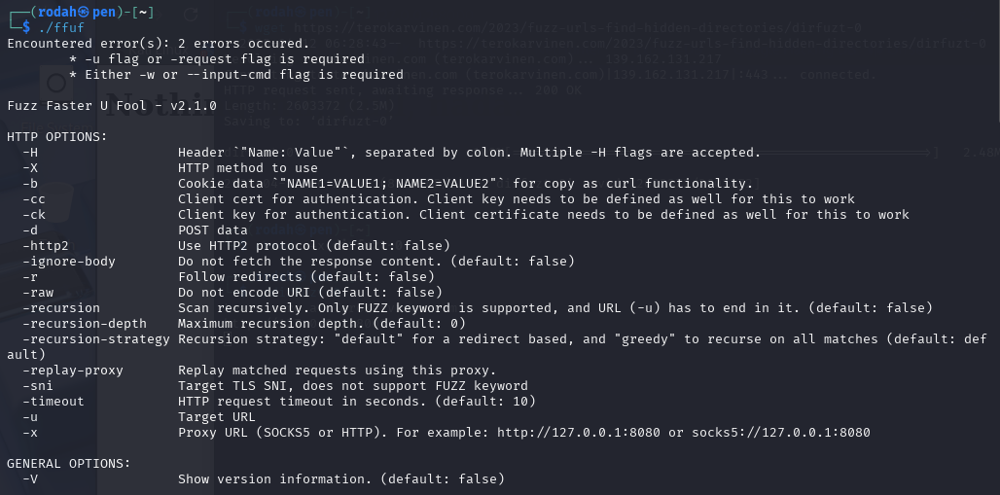

# X) Summaries / Tiivistelmät

## Find Hidden Web Directories - Fuzz URLs with ffuf

- Ffuf is a fast, full featured web fuzzer tool that automates fuzzing.
  
- Ffuf can be used to find hidden paths on web servers: directories or files (e.g /secret, /.svn /admin). Ffuf can also fuzz: request headers, POST parameters, query strings etc.
  
- Ffuf uses wordlists/dictionaries in the discovery process by replacing a placeholder (FUZZ) in the target URL with each word from the list. It systematically tries every word in place of FUZZ to identify valid endpoints or params.
  
- Ffuf utilizes wordlists in the discovery process. It inserts each word from the wordlist (FUZZ = placeholder where each word goes) tries all the words from the list in place of FUZZ, like: into the target that’s being tested.

**<ins>How to use ffuff</ins>:**
- Note: detailed installation in task A)
  
1.	Set up a target that mimics a web server with hidden paths/directories. (A  downloadable practice target is provided in the materials.)
2.	Install ffuf
3.	Download & use a wordlist/dictionary. 
4.	Run ffuf on the target using a wordlist/dictionary. E.g. basic command for directory discovery: `ffuf -w <wordlist> -u <target-url>/FUZZ`
5.	Results can be verified with browser or CURL
       
**<ins>Filtering noise: unwanted HTTP responses:</ins>**
- The target may respond with HTTP 200 OK for everything (including non-existent pages: “Nothing, nil, null, nada”), creating false positives. 
- The solution is to filter out the unwanted responses based on common characteristics.

- Filter options, e.g.:
    - `-fc`: filter by HTTP response status code
    - `-fs`: filter by HTTP response size (in bytes)
    - `-fw `: filter by number of words in the response
    - `-fl`: filter by number of lines

## ffuf README.md

**<ins>Basic usage:</ins>**

- Keywords:
  - `FUZZ` The main placeholder used in ffuf. Wherever the FUZZ -keyword is placed, the tool will substitute it with values from a wordlist. Can be used anywhere in the URL (`-u`), headers (`-h`) or POST data (`-d`)
    
- Options:
  - The readme.md and the help page (`ffuf -h`) provide a comprehensive list of options to use with ffuf
  - Includes options for HTTP, matchers, filters, inputs, outputs and other general options.  

**<ins>Advanced usage & detailed documentation:</ins>**

- ffuf wiki at https://github.com/ffuf/ffuf/wiki
- ffuf guide with real life usage examples by Michael Skelton at https://codingo.io/tools/ffuf/bounty/2020/09/17/everything-you-need-to-know-about-ffuf.html 

**<ins>Usage examples:</ins>**

- **1. Directory discovery**: `ffuf -w /path/to/wordlist -u https://target/FUZZ`
  
- **2. Virtual host discovery** to find hidden subdomains /virtual hosts on a server by fuzzing the Host – header: `ffuf -w /path/to/vhost/wordlist -u https://target -H "Host: FUZZ" -fs 4242`

- **3. GET parameter fuzzing**:
  - Fuzz parameter names: `ffuf -w /path/to/paramnames.txt -u https://target/script.php?FUZZ=test_value -fs 4242`
  - Fuzz parameter values (when param name is known): `ffuf -w /path/to/values.txt -u https://target/script.php?valid_name=FUZZ -fc 401`
    
- **4. POST data fuzzing**: `ffuf -w /path/to/postdata.txt -X POST -d "username=admin\&password=FUZZ" -u https://target/login.php -fc 401`
  
- **5. Execution time limit with maxtime (stops the fuzzing process after a specified time in seconds)**: 
  - Stop entire process (global):`ffuf -w /path/to/wordlist -u https://target/FUZZ -maxtime 60`
  - Stop current job, continue with next one: `ffuf -w /path/to/wordlist -u https://target/FUZZ -maxtime-job 60 -recursion -recursion-depth 2`
    
- **6. Using external mutator (script or program)** to modify or mutate the input data before sending it to the target, instead of generating values internally.

**<ins>Configurations:</ins>**

- The ffuf -tool checks for a default configuration file `ffufrc` which defines how  fuzzing should behave. The default config path is: `$XDG_CONFIG_HOME/ffuf/ffufrc`
- Configuration options provided on the CLI override the ones loaded from the default ffufrc file (except those allowing multiple values, like `-H`). 

**<ins>Interactive mode:</ins>**

- A feature that lets the user interact with the running ffuf scan in real-time. It allows adjustments to the scan through pausing the process instead of having to restart the whole scan.
- The interactive mode can be accessesd by pressing `ENTER` during ffuf execution,

## References / Lähteet:
- Karvinen 2023: Find Hidden Web Directories - Fuzz URLs with ffuf at https://terokarvinen.com/2023/fuzz-urls-find-hidden-directories/ 
- Hoikkala 2023: ffuf README.md at https://github.com/ffuf/ffuf/blob/master/README.md 

# A) Fuzzzz. Ratkaise dirfuz-1 artikkelista Karvinen 2023: Find Hidden Web Directories - Fuzz URLs with ffuf.

<ins>1. Set up a target:</ins>

Download & run a local dummy server (dirfuzt-1) that mimics a web server with hidden directories:
-`wget https://terokarvinen.com/2023/fuzz-urls-find-hidden-directories/dirfuzt-1`
- `chmod 744 dirfuzt-1`  change permissions
- `./dirfuzt-1` run the server
  
     
  
          

Access the dummy locally from the browser & verify that the test environment works: 
- `http://127.0.0.2:8000`
  
          

<ins>2. Install ffuf</ins>

Download and extract a release of ffuf:
-  `wget https://github.com/ffuf/ffuf/releases/download/v2.1.0/ffuf_2.1.0_linux_amd64.tar.gz` (latest release)
- `tar -xf ffuf_2.1.0_linux_amd64.tar.gz`
  
          

Run the ffuf tool to test that it works:
- `./ffuf` (from current directory)

          

<ins>3. Download & use a wordlist/dictionary. </ins>

- Selected dictionary: Seclists
- `wget https://raw.githubusercontent.com/danielmiessler/SecLists/master/Discovery/Web-Content/common.txt`
- `head -3 common.txt ` Shows the first 3 lines of the .txt file & provides a quick preview of 
- ` wc -l common.txt `  Counts the number of lines (entries) in common.txt. Each entry represents a URL /path tested with fuzzing.
  
          

<ins>4. Run Ffuf on the target </ins>

Disconnect the internet (to avoid leaking packets to the Internet)

Check ffuf parameters:
- `./ffuf` 
- `./ffuf |& less` Paginates the output
  
Run Ffuf on the target.
- `./ffuf -w common.txt -u http://127.0.0.2:8000/FUZZ`
  - The command replaces `FUZZ`placeholder with each word in the common.txt dictionary and sends requests to the specified target.
  - `w` Refers to the wordlist to be used
  - `u` Refers to the target URL
  
        

Filter out noise/false positives
- The target returns a long list of results including false positives (non-existent pages giving HTTP status 200 OK). The false positives will be filtered out from the results based on common qualities, in this case the HTTP response size which is 154 bytes (other commonalities incl. words and lines). 
- ` ./ffuf -w common.txt -u http://127.0.0.2:8000/FUZZ -fs 154 `
  
      
 
<ins>5. Verify results with browser or CURL</ins>

- Admin page: 
  - Browser - `http://127.0.0.2:8000/wp-admin`
  - CURL  - `curl http://127.0.0.2:8000/wp-admin`

- Version control (git) related pages:
  - Browser - `http://127.0.0.2:8000/.git`, `http://127.0.0.2:8000/.git/logs`  etc.
  - CURL - ` curl http://127.0.0.2:8000/.git/index`, ` curl http://127.0.0.2:8000/.git/logs`etc.
    
          
          
  

The hidden directories have been fuzzed succesfully. 

## References / Lähteet:
- Karvinen 2023: Find Hidden Web Directories - Fuzz URLs with ffuf at https://terokarvinen.com/2023/fuzz-urls-find-hidden-directories/

# B) Fuff me. Asenna FuffMe-harjoitusmaali. Karvinen 2023: Fuffme - Install Web Fuzzing Target on Debian
-

## References / Lähteet:
-Karvinen 2023: Fuffme - Install Web Fuzzing Target on Debian at https://terokarvinen.com/2023/fuffme-web-fuzzing-target-debian/ 

# C-I) Ratkaise FuffMe harjoitukset

-
### C) Basic Content Discovery
## D) Content Discovery With Recursion
## E) Content Discovery With File Extensions
## F) No 404 Status
## G) Param Mining
## H) Rate Limited
## I) Subdomains - Virtual Host Enumeration

## References / Lähteet:
- Karvinen 2023: Fuffme - Install Web Fuzzing Target on Debian at https://terokarvinen.com/2023/fuffme-web-fuzzing-target-debian/ 

# Tehtävänanto:
- Karvinen 2025 - Tunkeutumistestaus at https://terokarvinen.com/tunkeutumistestaus/#h3-fuzzy
